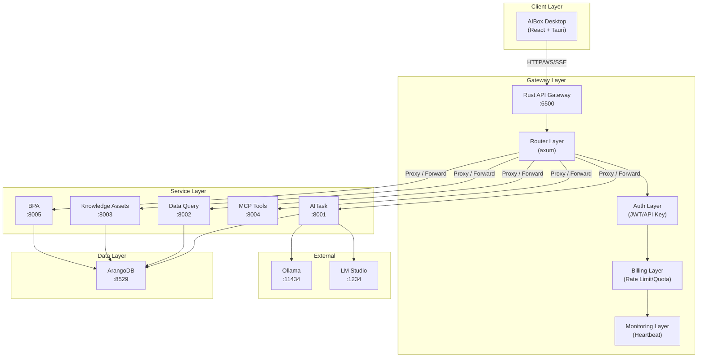
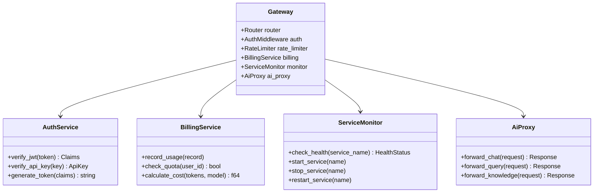
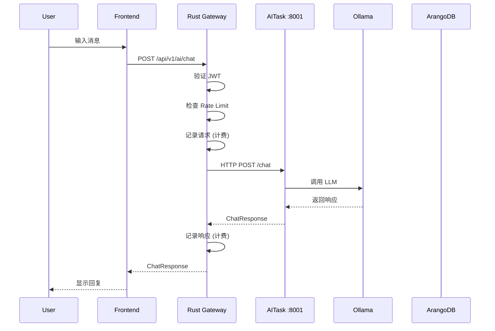
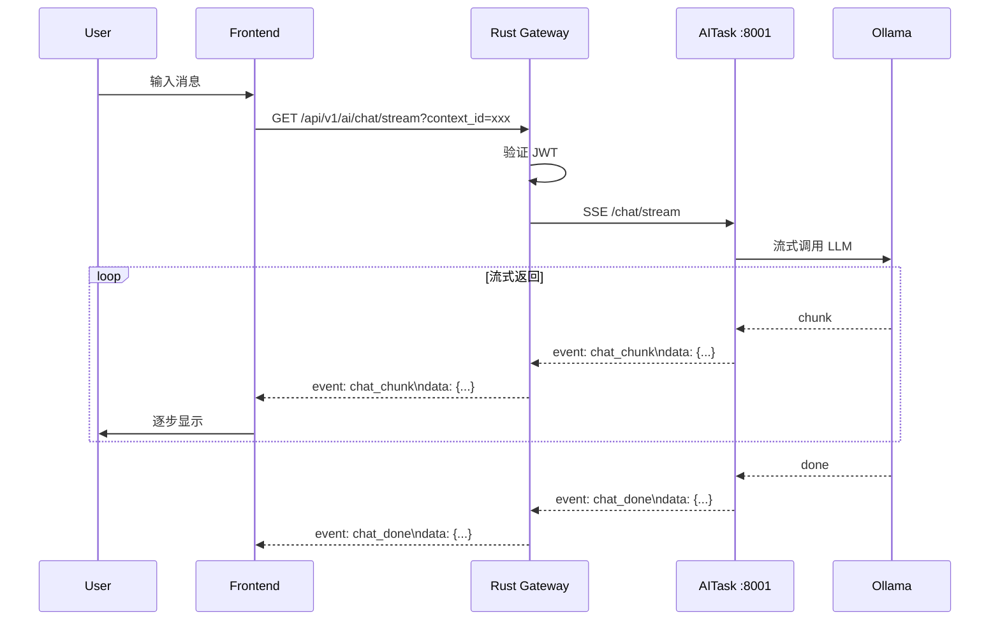
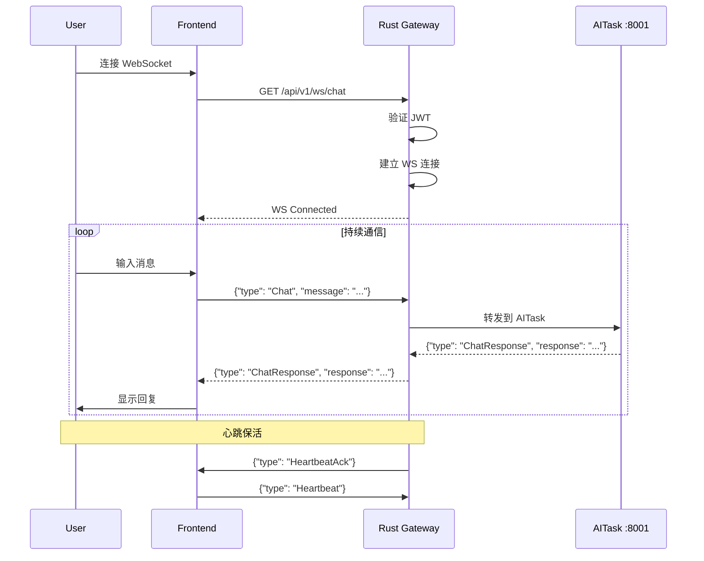
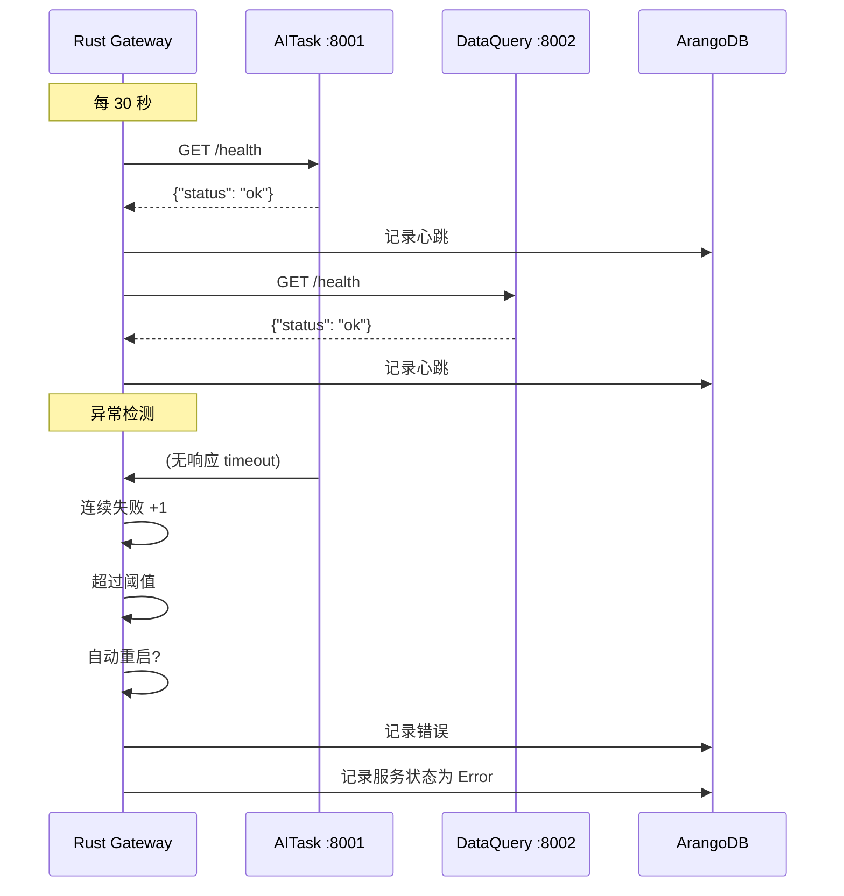
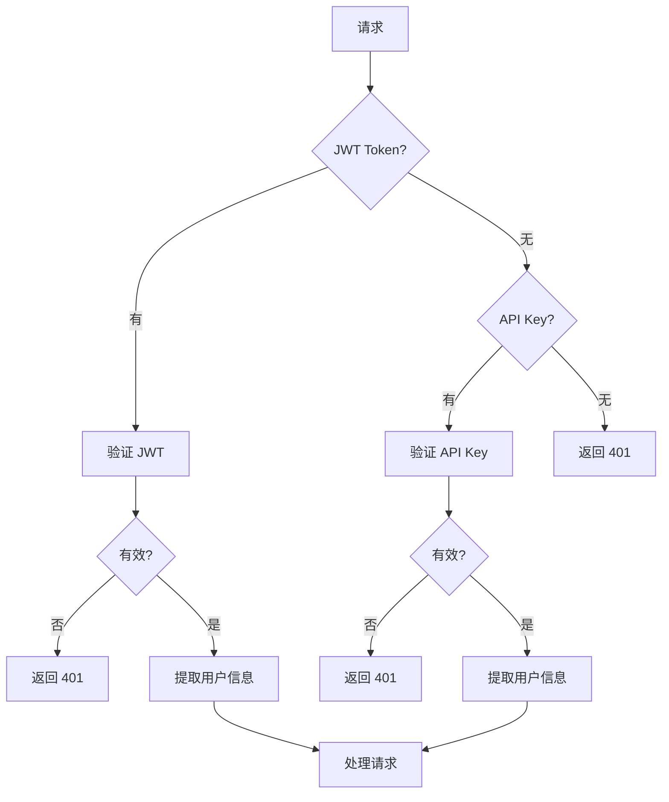

# AIBox AI Agent 系统规格书

## 1. 系统概览

### 1.1 架构图



### 1.2 组件关系图



---

## 2. Rust API Gateway 规格

### 2.1 项目结构

```
api/
├── src/
│   ├── main.rs                 # 入口
│   ├── lib.rs                  # 库导出
│   ├── config.rs               # 配置
│   ├── error.rs                # 错误定义
│   │
│   ├── api/                    # API 路由
│   │   ├── mod.rs
│   │   ├── auth.rs            # 认证接口
│   │   ├── sse.rs             # SSE 接口
│   │   ├── ws.rs              # WebSocket 接口
│   │   ├── ai.rs              # AI 路由（核心）
│   │   ├── billing.rs         # 计费接口
│   │   ├── services.rs        # 服务管理接口
│   │   └── health.rs          # 健康检查
│   │
│   ├── middleware/             # 中间件
│   │   ├── mod.rs
│   │   ├── auth.rs            # JWT 验证
│   │   ├── rate_limit.rs      # 速率限制
│   │   └── logging.rs         # 请求日志
│   │
│   ├── services/               # 业务服务
│   │   ├── mod.rs
│   │   ├── ai_proxy.rs        # AI 服务代理
│   │   ├── billing.rs         # 计费逻辑
│   │   ├── heartbeat.rs       # 心跳检测
│   │   ├── service_ctl.rs     # 服务控制
│   │   └── health_check.rs    # 健康检查
│   │
│   ├── models/                 # 数据模型
│   │   ├── mod.rs
│   │   ├── auth.rs           # 认证模型
│   │   ├── billing.rs        # 计费模型
│   │   ├── service.rs        # 服务模型
│   │   └── ai.rs             # AI 模型
│   │
│   └── db/                     # 数据库
│       ├── mod.rs
│       ├── client.rs          # ArangoDB 客户端
│       └── collections.rs     # 集合操作
│
├── Cargo.toml
├── .env
└── README.md
```

### 2.2 核心接口规格

#### 2.2.1 AI 路由 (ai.rs)

```rust
// 路由设计
Router::new()
    .route("/api/v1/ai/chat", post(ai_chat))           // AI 对话
    .route("/api/v1/ai/chat/stream", get(ai_chat_sse)) // SSE 流式
    .route("/api/v1/ai/chat/ws", get(ws_handler))      // WebSocket
    .route("/api/v1/ai/query", post(ai_query))         // 数据查询
    .route("/api/v1/ai/knowledge/*path", proxy_to_knowledge()) // 知识库
    .route("/api/v1/ai/mcp/*path", proxy_to_mcp())     // MCP 工具
    .route("/api/v1/ai/bpa/*path", proxy_to_bpa())     // BPA 流程
```

**接口定义**

```rust
// POST /api/v1/ai/chat
#[derive(Debug, Deserialize)]
struct ChatRequest {
    message: String,
    context_id: Option<String>,
    model: Option<String>,      // default: "llama3"
}

#[derive(Debug, Serialize)]
struct ChatResponse {
    response: String,
    context_id: String,
    tokens_used: u32,
    model: String,
    finish_reason: String,
}

// GET /api/v1/ai/chat/stream (SSE)
struct SseChatEvent {
    event: String,        // "chunk" | "done" | "error"
    data: String,         // response text
    context_id: String,
}

// GET /api/v1/ai/chat/ws (WebSocket)
enum WsMessage {
    Chat { message: String },
    Heartbeat,
    Error { message: String },
}
```

#### 2.2.2 计费路由 (billing.rs)

```rust
Router::new()
    .route("/api/v1/billing/usage", get(get_usage))           // 获取使用量
    .route("/api/v1/billing/quota", get(get_quota))           // 获取配额
    .route("/api/v1/billing/cost", get(get_cost))             // 获取费用
    .route("/api/v1/billing/history", get(get_history))      // 使用历史
    .route("/api/v1/billing/api-keys", get(list_api_keys))    // API Key 列表
    .route("/api/v1/billing/api-keys", post(create_api_key))  // 创建 API Key
    .route("/api/v1/billing/api-keys/:id", delete(revoke_api_key)) // 撤销
```

**接口定义**

```rust
// GET /api/v1/billing/usage?period=month
#[derive(Debug, Serialize)]
struct UsageResponse {
    user_key: String,
    period: String,
    total_tokens: u64,
    total_requests: u64,
    total_cost: f64,
    breakdown: Vec<ServiceUsage>,
}

struct ServiceUsage {
    service: String,
    tokens: u64,
    requests: u64,
    cost: f64,
}

// GET /api/v1/billing/quota
#[derive(Debug, Serialize)]
struct QuotaResponse {
    user_key: String,
    month: String,
    limit: u64,
    used: u64,
    remaining: u64,
    reset_at: String,
}

// POST /api/v1/billing/api-keys
#[derive(Debug, Deserialize)]
struct CreateApiKeyRequest {
    name: String,
    rate_limit: Option<u32>,    // per minute
    monthly_quota: Option<u64>,
    scopes: Vec<String>,        // ["ai.chat", "ai.query"]
}

#[derive(Debug, Serialize)]
struct CreateApiKeyResponse {
    key: String,                // only returned once!
    name: String,
    expires_at: String,
}
```

#### 2.2.3 服务管理路由 (services.rs)

```rust
Router::new()
    .route("/api/v1/services", get(list_services))           // 服务列表
    .route("/api/v1/services/:name", get(get_service))       // 服务状态
    .route("/api/v1/services/:name/start", post(start_service))   // 启动
    .route("/api/v1/services/:name/stop", post(stop_service))    // 停止
    .route("/api/v1/services/:name/restart", post(restart_service)) // 重启
    .route("/api/v1/services/:name/logs", get(get_logs))       // 日志
    .route("/api/v1/services/:name/health", get(get_health))  // 健康检查
    .route("/api/v1/services/register", post(register_service)) // 注册服务
```

**接口定义**

```rust
// GET /api/v1/services
#[derive(Debug, Serialize)]
struct ServiceListResponse {
    services: Vec<ServiceInfo>,
}

struct ServiceInfo {
    name: String,
    display_name: String,
    status: ServiceStatus,
    port: u16,
    health_check_url: String,
    last_heartbeat: String,
    uptime_seconds: u64,
}

enum ServiceStatus {
    Running,
    Stopped,
    Starting,
    Stopping,
    Error,
    Unknown,
}

// POST /api/v1/services/register
#[derive(Debug, Deserialize)]
struct RegisterServiceRequest {
    name: String,
    display_name: String,
    command: String,
    working_dir: String,
    port: u16,
    health_check_url: String,
    auto_restart: bool,
}
```

#### 2.2.4 SSE 接口 (sse.rs)

```rust
Router::new()
    .route("/api/v1/sse/chat/:context_id", get(sse_chat))     // 对话流
    .route("/api/v1/sse/events", get(sse_events))            // 通用事件
    .route("/api/v1/sse/notifications", get(sse_notifications)) // 通知
```

**SSE 事件格式**

```rust
struct SseEvent {
    // 格式: text/event-stream
    // field: event\n
    // field: data: json\n\n
    
    event: String,    // 事件类型
    data: String,     // JSON 数据
    id: Option<String>, // 事件 ID (用于断点重连)
    retry: u64,      // 重连间隔 (ms)
}

// 事件类型
// - "chat_chunk": AI 响应片段
// - "chat_done": 对话完成
// - "notification": 系统通知
// - "heartbeat": 心跳
// - "error": 错误
```

#### 2.2.5 WebSocket 接口 (ws.rs)

```rust
Router::new()
    .route("/api/v1/ws/chat", get(ws_chat))    // 聊天 WebSocket
    .route("/api/v1/ws/monitor", get(ws_monitor)) // 监控 WebSocket
```

**WebSocket 消息格式**

```rust
// Client -> Server
#[derive(Debug, Deserialize)]
#[serde(tag = "type")]
enum WsClientMessage {
    Chat { message: String, context_id: Option<String> },
    Heartbeat,
    Subscribe { channel: String },
    Unsubscribe { channel: String },
}

// Server -> Client
#[derive(Debug, Serialize)]
#[serde(tag = "type")]
enum WsServerMessage {
    ChatResponse { 
        response: String, 
        context_id: String,
        tokens: u32 
    },
    ChatChunk { chunk: String },
    HeartbeatAck,
    Notification { title: String, body: String },
    Error { code: String, message: String },
}
```

### 2.3 中间件规格

#### 2.3.1 认证中间件 (middleware/auth.rs)

```rust
// JWT Claims
#[derive(Debug, Serialize, Deserialize)]
struct Claims {
    sub: String,              // user_key
    username: String,
    role: String,
    permissions: Vec<String>,
    exp: u64,
    iat: u64,
}

// API Key 结构
struct ApiKey {
    key: String,
    user_key: String,
    name: String,
    rate_limit: u32,
    monthly_quota: u64,
    scopes: Vec<String>,
    expires_at: Option<DateTime<Utc>>,
    created_at: DateTime<Utc>,
}
```

#### 2.3.2 速率限制中间件 (middleware/rate_limit.rs)

```rust
struct RateLimitConfig {
    max_requests: u32,     // 100
    window_secs: u64,      // 60
    burst_size: u32,      // 10
}

// 滑动窗口算法
struct SlidingWindowLimiter {
    requests: HashMap<String, Vec<Instant>>,
    config: RateLimitConfig,
}
```

### 2.4 服务规格

#### 2.4.1 AI 代理服务 (services/ai_proxy.rs)

```rust
// AI 服务配置
struct AiServiceConfig {
    aitask_url: String,        // http://localhost:8001
    data_query_url: String,    // http://localhost:8002
    knowledge_url: String,      // http://localhost:8003
    mcp_url: String,          // http://localhost:8004
    bpa_url: String,          // http://localhost:8005
    timeout_secs: u64,        // 30
    max_retries: u32,         // 3
}

// 代理转发
impl AiProxy {
    async fn forward_chat(&self, request: ChatRequest) -> Result<ChatResponse, AppError>;
    async fn forward_stream_chat(&self, request: ChatRequest) -> impl Stream<Item = SseEvent>;
    async fn forward_query(&self, request: QueryRequest) -> Result<QueryResponse, AppError>;
    async fn forward_knowledge(&self, method: Method, path: &str, body: Bytes) -> Result<Response, AppError>;
}
```

#### 2.4.2 心跳检测服务 (services/heartbeat.rs)

```rust
struct HeartbeatConfig {
    service_name: String,
    check_interval_secs: u64,  // 30
    timeout_secs: u64,          // 5
    health_check_url: String,
}

struct HealthStatus {
    status: ServiceStatus,
    response_time_ms: u64,
    last_check: DateTime<Utc>,
    error_message: Option<String>,
    consecutive_failures: u32,
}

// 心跳检测任务
async fn heartbeat_task(config: HeartbeatConfig) {
    loop {
        let status = check_health(&config.health_check_url).await;
        record_heartbeat(&config.service_name, &status).await;
        
        if status.status == ServiceStatus::Error {
            handle_service_error(&config).await;
        }
        
        tokio::time::sleep(Duration::from_secs(config.check_interval_secs)).await;
    }
}
```

#### 2.4.3 计费服务 (services/billing.rs)

```rust
// 计费配置
struct BillingConfig {
    // 价格 (每 1000 tokens)
    price_per_1k_tokens: HashMap<String, f64>, // model -> price
    // 价格 (每次请求)
    price_per_request: f64,
    // 免费额度
    free_tokens_per_month: u64,
}

// 使用记录
struct UsageRecord {
    user_key: String,
    service: String,
    model: Option<String>,
    input_tokens: u32,
    output_tokens: u32,
    total_tokens: u32,
    requests: u32,
    cost: f64,
    timestamp: DateTime<Utc>,
}

// 计费流程
impl BillingService {
    async fn record_and_charge(&self, user_key: &str, usage: UsageRecord) -> Result<(), AppError>;
    async fn check_quota(&self, user_key: &str) -> Result<QuotaInfo, AppError>;
    async fn calculate_cost(&self, tokens: u32, model: &str) -> f64;
    async fn get_usage_summary(&self, user_key: &str, period: &str) -> Result<UsageSummary, AppError>;
}
```

---

## 3. Python AI 服务规格

### 3.1 AITask 服务 (port 8001)

```
ai-services/aitask/
├── main.py                 # uvicorn 入口
├── app.py                  # FastAPI app
├── agent/
│   ├── registry.py         # Agent 注册表
│   ├── orchestrator.py    # Agent 协调器
│   ├── base.py           # Base Agent
│   └── openai.py         # OpenAI Agent
├── memory/
│   ├── short_term.py      # 短期记忆 (当前对话)
│   └── long_term.py       # 长期记忆 (向量存储)
├── chat/
│   ├── handler.py         # 对话处理
│   └── context.py         # 上下文管理
└── models/
    └── schemas.py         # Pydantic 模型
```

**接口**

```python
# POST /chat
class ChatRequest(BaseModel):
    message: str
    context_id: Optional[str] = None
    agent_id: Optional[str] = None
    model: str = "llama3"

class ChatResponse(BaseModel):
    response: str
    context_id: str
    tokens_used: int
    model: str
    finish_reason: str

# POST /agent/register
class RegisterAgentRequest(BaseModel):
    name: str
    description: str
    capabilities: List[str]
    endpoint: str

# POST /agent/orchestrate
class OrchestrateRequest(BaseModel):
    task: str
    required_agents: List[str]
```

### 3.2 Data Query Agent (port 8002)

```
ai-services/data-query/
├── main.py
├── app.py
├── nlp2sql/
│   ├── parser.py          # 自然语言解析
│   ├── generator.py      # SQL 生成
│   └── validator.py       # SQL 验证 (安全)
└── executor/
    └── runner.py         # 查询执行
```

**接口**

```python
# POST /query
class QueryRequest(BaseModel):
    question: str
    database: str = "aibox"

class QueryResponse(BaseModel):
    sql: str
    results: List[Dict]
    row_count: int
    execution_time_ms: int
```

### 3.3 Knowledge Assets Agent (port 8003)

```
ai-services/knowledge-assets/
├── main.py
├── app.py
├── vectorstore/
│   └── chromadb.py       # ChromaDB 集成
├── rag/
│   ├── retriever.py      # 检索
│   └── generator.py      # 生成
└── storage/
    └── arango.py         # ArangoDB 存储
```

**接口**

```python
# POST /knowledge/add
class AddKnowledgeRequest(BaseModel):
    content: str
    metadata: Dict
    category: str

# POST /knowledge/search
class SearchRequest(BaseModel):
    query: str
    top_k: int = 5

# POST /knowledge/rag
class RagRequest(BaseModel):
    question: str
    context: Optional[str] = None
```

### 3.4 MCP Tools (port 8004)

```
ai-services/mcp-tools/
├── main.py
├── app.py
├── protocol/
│   ├── types.py          # MCP 协议类型
│   └── handler.py        # 协议处理
└── registry/
    └── manager.py        # 工具注册
```

**接口**

```python
# GET /tools/list

# POST /tools/execute
class ExecuteRequest(BaseModel):
    tool_name: str
    parameters: Dict

# POST /tools/mcp/...  (MCP 协议转发)
```

### 3.5 BPA (port 8005)

```
ai-services/bpa/
├── main.py
├── app.py
├── engine/
│   ├── workflow.py       # 工作流引擎
│   ├── scheduler.py      # 任务调度
│   └── executor.py       # 执行器
└── models/
    └── definitions.py    # 流程定义
```

**接口**

```python
# POST /process/start
class ProcessRequest(BaseModel):
    process_name: str
    parameters: Dict

# GET /process/status/{process_id}

# GET /process/list
```

---

## 4. 数据模型规格

### 4.1 ArangoDB 集合

```javascript
// === 认证相关 ===

// users (已有)
{
  "_key": "user_xxx",
  "username": "admin",
  "name": "管理员",
  "role_key": "admin",
  "status": "active",
  "created_at": "2026-01-01"
}

// api_keys (新增)
{
  "_key": "ak_xxx",
  "user_key": "user_xxx",
  "key_hash": "sha256:xxx",  // 存储 hash，不存明文
  "name": "Production Key",
  "rate_limit": 100,
  "monthly_quota": 100000,
  "scopes": ["ai.chat", "ai.query"],
  "status": "active",
  "last_used_at": "2026-03-17T12:00:00Z",
  "expires_at": "2026-12-31T23:59:59Z",
  "created_at": "2026-01-01"
}

// === 计费相关 ===

// usage_logs (新增)
{
  "_key": "ul_xxx",
  "user_key": "user_xxx",
  "api_key": "ak_xxx",
  "service": "aitask",
  "model": "llama3",
  "input_tokens": 100,
  "output_tokens": 50,
  "total_tokens": 150,
  "requests": 1,
  "cost": 0.0015,
  "timestamp": "2026-03-17T12:00:00Z"
}

// quotas (新增)
{
  "_key": "q_user_xxx_2026-03",
  "user_key": "user_xxx",
  "month": "2026-03",
  "limit": 100000,
  "used": 50000,
  "notified": false
}

// === 服务相关 ===

// services (新增)
{
  "_key": "aitask",
  "display_name": "AI Task Service",
  "name": "aitask",
  "command": "cd ai-services/aitask && uvicorn main:app --port 8001",
  "working_dir": "/Users/daniel/GitHub/AIBox",
  "port": 8001,
  "health_check_url": "http://localhost:8001/health",
  "status": "running",
  "auto_restart": true,
  "max_restarts": 3,
  "created_at": "2026-01-01"
}

// heartbeats (新增)
{
  "_key": "hb_aitask_2026-03-17T12:00:00Z",
  "service_name": "aitask",
  "status": "healthy",
  "response_time_ms": 15,
  "error_message": null,
  "timestamp": "2026-03-17T12:00:00Z"
}

// service_logs (新增)
{
  "_key": "sl_xxx",
  "service_name": "aitask",
  "level": "info",
  "message": "Service started",
  "timestamp": "2026-03-17T12:00:00Z"
}

// === AI 相关 ===

// chat_contexts (新增)
{
  "_key": "ctx_xxx",
  "user_key": "user_xxx",
  "messages": [
    {"role": "user", "content": "Hello", "timestamp": "..."},
    {"role": "assistant", "content": "Hi!", "timestamp": "..."}
  ],
  "metadata": {},
  "created_at": "2026-03-17T12:00:00Z",
  "updated_at": "2026-03-17T12:00:00Z"
}

// agents (新增)
{
  "_key": "agent_xxx",
  "name": "DataAnalyst",
  "description": "数据分析助手",
  "capabilities": ["sql", "visualization", "statistics"],
  "endpoint": "http://localhost:8001/agent/data-analyst",
  "status": "active",
  "created_at": "2026-01-01"
}

// knowledge_docs (新增)
{
  "_key": "doc_xxx",
  "category": "technical",
  "title": "API 文档",
  "content": "...",
  "embedding": [...],  // 768维向量
  "metadata": {"author": "admin", "version": "1.0"},
  "created_at": "2026-01-01"
}
```

---

## 5. 通信流程

### 5.1 AI Chat 流程



### 5.2 SSE 流式响应流程



### 5.3 WebSocket 流程



### 5.4 服务监控流程



---

## 6. 环境变量规格

### 6.1 Rust API (.env)

```env
# ===================
# Database
# ===================
DATABASE_URL=http://localhost:8529
DATABASE_NAME=aibox
DATABASE_USER=root
DATABASE_PASSWORD=abc_desktop_2026

# ===================
# JWT
# ===================
JWT_SECRET=your-256-bit-secret-key-here
JWT_EXPIRATION_HOURS=24

# ===================
# AI Services
# ===================
AITASK_URL=http://localhost:8001
DATA_QUERY_URL=http://localhost:8002
KNOWLEDGE_ASSETS_URL=http://localhost:8003
MCP_TOOLS_URL=http://localhost:8004
BPA_URL=http://localhost:8005

# ===================
# External AI
# ===================
OLLAMA_BASE_URL=http://localhost:11434
LM_STUDIO_URL=http://localhost:1234

# ===================
# Rate Limiting
# ===================
RATE_LIMIT_MAX_REQUESTS=100
RATE_LIMIT_WINDOW_SECONDS=60

# ===================
# Billing
# ===================
BILLING_FREE_TOKENS_PER_MONTH=10000
BILLING_PRICE_PER_1K_TOKENS=0.001
```

### 6.2 Python Services (.env)

```env
# ===================
# Database
# ===================
ARANGO_URL=http://localhost:8529
ARANGO_DB=aibox
ARANGO_USER=root
ARANGO_PASSWORD=abc_desktop_2026

# ===================
# AI
# ===================
OLLAMA_BASE_URL=http://localhost:11434
OLLAMA_MODEL=llama3
EMBEDDING_MODEL=mxbai-embed-large

# ===================
# Vector Store
# ===================
CHROMA_PERSIST_DIR=./data/chroma

# ===================
# Gateway
# ===================
API_GATEWAY_URL=http://localhost:6500
```

---

## 7. 错误处理规格

### 7.1 错误码

| 状态码 | 错误码 | 说明 |
|--------|--------|------|
| 400 | BAD_REQUEST | 请求参数错误 |
| 401 | UNAUTHORIZED | 未认证 |
| 403 | FORBIDDEN | 无权限 |
| 429 | RATE_LIMITED | 超出速率限制 |
| 451 | QUOTA_EXCEEDED | 超出配额 |
| 502 | BAD_GATEWAY | 上游服务错误 |
| 503 | SERVICE_UNAVAILABLE | 服务不可用 |

### 7.2 错误响应格式

```json
{
  "code": 429,
  "error": "RATE_LIMITED",
  "message": "请求频率超限，请稍后再试",
  "details": {
    "limit": 100,
    "window": 60,
    "retry_after": 30
  }
}
```

---

## 8. 安全规格

### 8.1 认证流程



### 8.2 SQL 注入防护 (Data Query)

```rust
// 允许的表
const ALLOWED_TABLES: &[&str] = &["users", "roles", "functions", "system_params"];

// 验证 SQL
fn validate_sql(sql: &str) -> Result<(), AppError> {
    // 1. 只允许 SELECT
    if !sql.trim().to_uppercase().starts_with("SELECT") {
        return Err(AppError::InvalidQuery("Only SELECT allowed".into()));
    }
    
    // 2. 检查表名白名单
    for table in ALLOWED_TABLES {
        if sql.contains(table) {
            return Ok(());
        }
    }
    
    Err(AppError::InvalidQuery("Table not allowed".into()))
}
```

---

## 9. 测试规格

### 9.1 单元测试

- [ ] JWT 签发/验证
- [ ] Rate Limiter 算法
- [ ] 计费计算
- [ ] SQL 验证

### 9.2 集成测试

- [ ] API 认证流程
- [ ] AI 聊天流程
- [ ] SSE 流式响应
- [ ] WebSocket 连接
- [ ] 服务健康检查

### 9.3 负载测试

- [ ] 100 并发请求
- [ ] 1000 并发请求
- [ ] SSE 10K 连接
- [ ] WebSocket 10K 连接

---

## 10. 部署规格

### 10.1 启动顺序

```bash
# 1. ArangoDB
docker run -d --name arangodb -p 8529:8529 \
  -e ARANGO_ROOT_PASSWORD=abc_desktop_2026 \
  arangodb:latest

# 2. Rust API Gateway
cd api && cargo run --release

# 3. Python AI Services (分开终端)
cd ai-services/aitask && uvicorn main:app --port 8001
cd ai-services/data-query && uvicorn main:app --port 8002
cd ai-services/knowledge-assets && uvicorn main:app --port 8003
cd ai-services/mcp-tools && uvicorn main:app --port 8004
cd ai-services/bpa && uvicorn main:app --port 8005

# 4. Frontend
npm run dev
```

### 10.2 端口分配

| 服务 | 端口 | 协议 |
|------|------|------|
| Rust API Gateway | 6500 | HTTP/WS/SSE |
| AITask | 8001 | HTTP |
| Data Query | 8002 | HTTP |
| Knowledge Assets | 8003 | HTTP |
| MCP Tools | 8004 | HTTP |
| BPA | 8005 | HTTP |
| Frontend (dev) | 1420 | HTTP |
| Frontend (preview) | 6000 | HTTP |
| ArangoDB | 8529 | HTTP |
| Ollama | 11434 | HTTP |

---

## 11. 监控规格

### 11.1 指标

| 指标 | 类型 | 描述 |
|------|------|------|
| api_requests_total | Counter | 总请求数 |
| api_latency_seconds | Histogram | 请求延迟 |
| ai_tokens_used | Counter | AI Token 消耗 |
| active_connections | Gauge | 活跃连接数 |
| service_health | Gauge | 服务健康状态 |

### 11.2 日志

```json
{
  "timestamp": "2026-03-17T12:00:00Z",
  "level": "info",
  "service": "gateway",
  "action": "ai_chat",
  "user_key": "user_xxx",
  "latency_ms": 150,
  "tokens": 100,
  "cost": 0.001
}
```

---

## 12. 后续扩展

### 12.1 可添加功能

- [ ] OAuth2 支持
- [ ] Webhook 通知
- [ ] 多租户支持
- [ ] 分布式部署 (Kubernetes)
- [ ] Prometheus 监控集成
- [ ] Grafana 仪表板

---

*规格版本: 1.0.0*
*最后更新: 2026-03-17*
*作者: AIBox Team*
