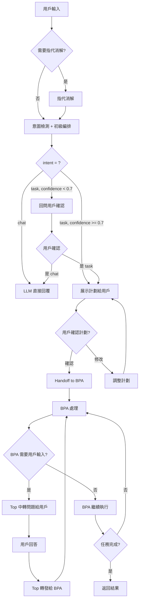

# Top Level Orchestrator 規格說明書 v2.0

## 文檔修訂歷史

| 版本 | 日期 | 修訂內容 | 修訂人 |
|------|------|----------|--------|
| 1.0 | 2024-03-19 | 初始版本，定義基礎架構與通信協議 | 原作者 |
| 2.0 | 2026-03-22 | 補齊持久化、權限、協議工程細節、意圖檢測增強、BPA Registry 治理 | Daniel Chung |

---

## 目錄

1. [系統架構](#一系統架構)
2. [Top Orchestrator 詳細設計](#二top-orchestrator-詳細設計)
3. [BPA Orchestrator 詳細設計](#三bpa-orchestrator-詳細設計)
4. [通信協議 (Handoff Protocol)](#四通信協議-handoff-protocol)
5. [持久化與檢查點機制](#五持久化與檢查點機制)
6. [安全與權限模型](#六安全與權限模型)
7. [錯誤處理與容錯](#七錯誤處理與容錯)
8. [部署與整合](#八部署與整合)
9. [對話流程示例](#九對話流程示例)
10. [附錄](#十附錄)

---

## 一、系統架構

### 1.1 三層架構圖

```
┌─────────────────────────────────────────────────────────────────────────┐
│                    Top Orchestrator (顶层编排器)                        │
│  ┌─────────────────────────────────────────────────────────────────────┐│
│  │  核心職責：                                                          ││
│  │  - 會話管理（啟動/切換/結束）                                        ││
│  │  - 意圖檢測（chat vs task）+ 低信心回問                             ││
│  │  - 初級編排（簡單拆分為子任務）                                      ││
│  │  - BPA 路由與中轉                                                    ││
│  │  - 上下文管理（對話歷史、實體記憶）                                  ││
│  │  - 指代消解（可選，僅在檢測到指代詞時）                              ││
│  └─────────────────────────────────────────────────────────────────────┘│
│                              │                                          │
│                    ┌─────────┴─────────┐                               │
│                    │  Handoff Protocol │                               │
│                    │  (JSON over HTTP)  │                               │
│                    └─────────┬─────────┘                               │
└──────────────────────────────┼──────────────────────────────────────────┘
                               │
                               ▼
┌─────────────────────────────────────────────────────────────────────────┐
│                       BPA Orchestrator (业务流程编排器)                 │
│  ┌─────────────────────────────────────────────────────────────────────┐│
│  │  核心職責：                                                          ││
│  │  - 深層流程編排（詳細任務分解）                                      ││
│  │  - 調用 DA 執行數據操作                                              ││
│  │  - 多輪對話（通過 Top 與用戶交互）                                   ││
│  │  - 任務狀態管理（狀態機）                                            ││
│  │  - 結果聚合與業務解釋                                                ││
│  └─────────────────────────────────────────────────────────────────────┘│
└─────────────────────────────────────────────────────────────────────────┘
                               │
                               ▼
┌─────────────────────────────────────────────────────────────────────────┐
│                         Data Agent (DA)                                 │
│                    数据抽象层：CRUD + 聚合计算                           │
│                    (独立规格书，后续补充)                                │
└─────────────────────────────────────────────────────────────────────────┘
```

### 1.2 與 AIBox 基礎設施整合

```
┌─────────────────────────────────────────────────────────────────────────┐
│                         AIBox 前端 (Tauri + React)                      │
│                              :1420                                       │
└────────────────────────────┬────────────────────────────────────────────┘
                             │ HTTP/SSE/WebSocket
                             ▼
┌─────────────────────────────────────────────────────────────────────────┐
│                    Rust API Gateway (:6500)                             │
│  ┌──────────────────────────────────────────────────────────────────┐  │
│  │  - JWT 認證                                                       │  │
│  │  - Rate Limiting                                                 │  │
│  │  - Billing 計費                                                  │  │
│  │  - Service Routing                                               │  │
│  └──────────────────────────────────────────────────────────────────┘  │
└────────────────────────────┬────────────────────────────────────────────┘
                             │ Forward to
                             ▼
┌─────────────────────────────────────────────────────────────────────────┐
│              Top Orchestrator (Python FastAPI :8006)                    │
│  - 接收來自 Gateway 的請求                                               │
│  - 意圖檢測 + 初級編排                                                   │
│  - 路由到對應 BPA                                                        │
│  - 中轉 BPA ↔ 用戶的多輪對話                                             │
└────────────────────────────┬────────────────────────────────────────────┘
                             │ HTTP POST
                             ▼
┌─────────────────────────────────────────────────────────────────────────┐
│                BPA Services (Python FastAPI)                            │
│  - Order BPA (:8010)                                                    │
│  - Finance BPA (:8011)                                                  │
│  - Material BPA (:8012)                                                 │
│  - ...                                                                  │
└────────────────────────────┬────────────────────────────────────────────┘
                             │ Query DA
                             ▼
┌─────────────────────────────────────────────────────────────────────────┐
│                    Data Agent (DA) (:8002)                              │
│                    (独立规格书)                                          │
└─────────────────────────────────────────────────────────────────────────┘
                             │
                             ▼
┌─────────────────────────────────────────────────────────────────────────┐
│                       ArangoDB (:8529)                                  │
│  - sessions (會話狀態)                                                   │
│  - checkpoints (檢查點)                                                  │
│  - entities (實體記憶)                                                   │
│  - bpa_registry (BPA 註冊表)                                             │
└─────────────────────────────────────────────────────────────────────────┘
```

---

## 二、Top Orchestrator 詳細設計

### 2.1 核心職責清單

| 職責 | 描述 | 約束 |
|-----|------|------|
| **會話管理** | 啟動/切換/結束 Task Chat | 每個 session_id 對應一個獨立對話 |
| **意圖檢測** | 判斷是 chat 還是 task | 低信心時回問用戶 (confidence < 0.7) |
| **初級編排** | 簡單拆分任務為子任務 | 不深入細節，只做高層拆分 |
| **BPA 路由** | 將任務交給對應 BPA | 基於靜態 manifest，不允許動態註冊 |
| **消息中轉** | BPA ↔ 用戶多輪對話中轉 | Top 只做 relay，不推導任務狀態 |
| **上下文管理** | 管理對話歷史與實體記憶 | 對話事件流為 SSOT (Single Source of Truth) |
| **指代消解** | 解析"它/那個"等指代詞 | 僅在檢測到指代詞時觸發，避免不必要的 LLM 呼叫 |

### 2.2 意圖檢測增強

#### 2.2.1 合併意圖檢測 + 初級編排 (減少 LLM 呼叫)

**設計目標**：將原本 2 次 LLM 呼叫（意圖分類 + 任務拆分）合併為 1 次，降低延遲。

**Prompt 模板**：

```python
INTENT_AND_DECOMPOSITION_PROMPT = """
你是一個智能任務助理，負責理解用戶意圖並進行初步規劃。

用戶消息：{user_message}

對話歷史（最近 5 輪）：
{history}

請分析用戶意圖並輸出 JSON 格式：

{{
  "intent": "chat|task",
  "confidence": 0.0-1.0,
  "reasoning": "判斷依據",
  
  # 如果 intent = "task"，則必須填寫以下欄位：
  "task_info": {{
    "task_type": "query|action|workflow",
    "domain": "order|finance|material|customer|...",
    "subtasks": [
      {{
        "id": 1,
        "description": "子任務描述",
        "bpa_hint": "建議由哪個 BPA 處理"
      }}
    ],
    "extracted_entities": {{
      "order_id": "OR-001",
      "...": "..."
    }}
  }}
}}

規則：
1. intent = "chat": 閒聊、問候、情感表達、無需執行操作的問答
2. intent = "task": 需要查詢數據、執行業務操作、生成報表等
3. confidence < 0.7 時，系統會回問用戶確認
4. 子任務拆分僅做高層次拆分，每個子任務應該清晰獨立
5. 如果用戶消息模糊，extracted_entities 可為空，但必須標註缺失的信息
"""
```

#### 2.2.2 低信心回問機制

當 `confidence < 0.7` 時，Top 應回問用戶確認：

```python
if intent_result["confidence"] < 0.7:
    clarification_message = f"""
    抱歉，我不太確定您的意思。請確認：
    
    您是想要：
    1️⃣ 查詢/執行業務操作（例如：查訂單、生成報表、處理退貨）
    2️⃣ 一般問答/閒聊
    
    請回覆 1 或 2，或者重新描述您的需求。
    """
    return clarification_message
```

#### 2.2.3 指代消解（按需觸發）

**觸發條件**：檢測到指代詞（"它"、"那個"、"這個"、"他"、"她"）時才觸發。

```python
COREFERENCE_DETECTION_PATTERN = r"(它|那個|這個|他|她|這筆|那筆)"

def needs_coreference_resolution(message: str) -> bool:
    """檢測是否需要指代消解"""
    return bool(re.search(COREFERENCE_DETECTION_PATTERN, message))

COREFERENCE_RESOLUTION_PROMPT = """
以下是對話歷史，找出指代詞具體指代什麼。

對話歷史：
{history}

當前消息：{current_message}

輸出 JSON：
{{
  "resolved": "具體指代的內容",
  "entity_type": "order|customer|material|...",
  "entity_id": "OR-001",
  "source": "inferred",
  "evidence_span": "原文中的證據片段"
}}

重要：
1. source 必須標註為 "user_text"（明示）或 "inferred"（推斷）
2. evidence_span 必須引用原文，避免推理污染
3. 若無法確定，返回 {{"resolved": null}}
"""
```

### 2.3 消息流程詳細設計



### 2.4 狀態管理

#### 2.4.1 TopState 數據結構

```python
from enum import Enum
from typing import Dict, List, Optional, Any
from datetime import datetime
from pydantic import BaseModel, Field

class ModeEnum(str, Enum):
    CHAT = "chat"
    TASK = "task"

class Message(BaseModel):
    role: str  # "user" | "assistant" | "system"
    content: str
    timestamp: datetime
    metadata: Optional[Dict[str, Any]] = None

class Entity(BaseModel):
    entity_type: str  # "order" | "customer" | "material" | ...
    entity_id: str
    entity_value: Any
    source: str  # "user_text" | "inferred"
    evidence_span: Optional[str] = None  # 原文證據
    confidence: float = 1.0
    created_at: datetime

class TopState(BaseModel):
    # 會話標識
    session_id: str
    user_id: str
    created_at: datetime
    updated_at: datetime
    
    # 模式
    mode: ModeEnum = ModeEnum.CHAT
    active_bpa: Optional[str] = None  # 當前活躍的 BPA ID
    
    # 對話歷史（SSOT）
    history: List[Message] = Field(default_factory=list)
    
    # 實體記憶
    entities: Dict[str, Entity] = Field(default_factory=dict)
    
    # 短期記憶（會話內）
    short_term_memory: Dict[str, Any] = Field(default_factory=dict)
    
    # 長期記憶（用戶偏好，從 DB 載入）
    long_term_memory: Dict[str, Any] = Field(default_factory=dict)
    
    # 當前任務計劃（如果有）
    current_plan: Optional[Dict[str, Any]] = None
    
    # 協議版本
    protocol_version: str = "2.0"
```

#### 2.4.2 狀態持久化策略

**存儲位置**：ArangoDB `sessions` collection

**存儲時機**：
- 每次用戶發送消息後
- 每次 BPA 返回消息後
- 每次狀態變更（mode 切換、active_bpa 變更）

**存儲格式**：

```json
{
  "_key": "sess_abc123",
  "session_id": "sess_abc123",
  "user_id": "user_xxx",
  "created_at": "2026-03-22T10:00:00Z",
  "updated_at": "2026-03-22T10:05:00Z",
  "mode": "task",
  "active_bpa": "order-bpa",
  "history": [...],
  "entities": {...},
  "short_term_memory": {...},
  "current_plan": {...},
  "protocol_version": "2.0"
}
```

---

## 三、BPA Orchestrator 詳細設計

### 3.1 核心職責清單

| 職責 | 描述 | 約束 |
|-----|------|------|
| **深層編排** | 詳細任務分解與流程編排 | 可使用 LangGraph 或自定義狀態機 |
| **DA 調用** | 調用 Data Agent 執行數據操作 | 必須遵循 DA API 合約 |
| **多輪對話** | 通過 Top 與用戶交互獲取信息 | 使用 `BPA_ASK_USER` 消息類型 |
| **狀態管理** | 維護任務執行狀態機 | 狀態：idle/running/waiting/completed/failed |
| **結果聚合** | 匯總子任務結果並生成業務解釋 | 輸出面向業務用戶，非技術細節 |

### 3.2 BPA 定義格式（擴展版）

```json
{
  "id": "order-bpa",
  "name": "訂單管理 BPA",
  "description": "處理訂單相關業務流程",
  "version": "1.0.0",
  "status": "active",
  
  "capabilities": [
    "order_query",
    "order_update",
    "return_process",
    "refund_execute"
  ],
  
  "tools": [
    {
      "tool_id": "da-order-query",
      "tool_type": "data_query",
      "description": "查詢訂單數據",
      "endpoint": "http://localhost:8002/query",
      "auth_required": true
    },
    {
      "tool_id": "da-order-update",
      "tool_type": "data_mutation",
      "description": "更新訂單狀態",
      "endpoint": "http://localhost:8002/mutate",
      "auth_required": true,
      "requires_idempotency_key": true
    }
  ],
  
  "prompts": {
    "task_decomposition": "你是一個訂單管理專家...",
    "flow_orchestration": "根據任務類型，選擇合適的流程...",
    "result_summary": "訂單處理完成："
  },
  
  "permissions": {
    "required_scopes": ["order:read", "order:write"],
    "allowed_collections": ["orders", "customers", "returns"],
    "rate_limit": {
      "max_requests_per_minute": 100
    }
  },
  
  "config": {
    "max_retries": 3,
    "timeout_seconds": 60,
    "checkpoint_interval": 5
  }
}
```

### 3.3 BPA Registry 治理機制

#### 3.3.1 靜態註冊（生產環境）

**設計決策**：生產環境不允許動態註冊，所有 BPA 必須在啟動時從配置文件或 DB 載入。

**載入方式**：

```python
class BPARegistry:
    """BPA 註冊表 - 靜態註冊模式"""
    
    def __init__(self, db_client):
        self.db = db_client
        self.bpas: Dict[str, BPAOrchestrator] = {}
        self.load_from_db()
    
    def load_from_db(self):
        """從數據庫載入已批准的 BPA 配置"""
        bpa_configs = self.db.collection("bpa_registry").all()
        for config in bpa_configs:
            if config["status"] == "active":
                self.register(config)
    
    def register(self, bpa_config: dict):
        """註冊 BPA（僅內部調用）"""
        # 驗證配置完整性
        self._validate_config(bpa_config)
        
        # 創建 BPA 實例
        bpa = BPAOrchestrator(bpa_config)
        self.bpas[bpa_config["id"]] = bpa
        
        logger.info(f"BPA registered: {bpa_config['id']} v{bpa_config['version']}")
    
    def get(self, bpa_id: str) -> BPAOrchestrator:
        """獲取 BPA 實例"""
        if bpa_id not in self.bpas:
            raise BPANotFoundError(f"BPA {bpa_id} 未註冊")
        return self.bpas[bpa_id]
    
    def _validate_config(self, config: dict):
        """驗證 BPA 配置完整性"""
        required_fields = ["id", "name", "version", "capabilities", "tools", "permissions"]
        for field in required_fields:
            if field not in config:
                raise ValueError(f"BPA config missing required field: {field}")
```

#### 3.3.2 開發環境動態註冊（可選）

僅在開發/測試環境允許，且必須通過管理接口：

```python
@app.post("/admin/bpa/register")
async def register_bpa(
    config: BPAConfig,
    admin_token: str = Header(...),
    db: Database = Depends(get_db)
):
    """管理員註冊新 BPA（僅開發環境）"""
    if not settings.ALLOW_DYNAMIC_BPA_REGISTRATION:
        raise HTTPException(status_code=403, detail="Dynamic registration disabled in production")
    
    # 驗證管理員權限
    verify_admin_token(admin_token)
    
    # 驗證配置
    validate_bpa_config(config)
    
    # 存入 DB
    db.collection("bpa_registry").insert({
        **config.dict(),
        "status": "pending_approval",
        "created_at": datetime.utcnow(),
        "created_by": admin_token
    })
    
    return {"message": "BPA registered, pending approval"}
```

### 3.4 BPA 狀態管理

```python
class BPAState(BaseModel):
    bpa_id: str
    session_id: str  # 關聯的 Top session
    
    # 任務
    tasks: List[Task] = Field(default_factory=list)
    current_task: Optional[str] = None
    
    # 執行狀態
    status: str = "idle"  # idle | running | waiting | completed | failed
    
    # 中間結果
    results: Dict[str, Any] = Field(default_factory=dict)
    
    # 與用戶交互
    pending_questions: List[Question] = Field(default_factory=list)
    
    # 檢查點版本
    checkpoint_version: int = 0
    last_checkpoint_at: Optional[datetime] = None
    
    # 工具調用記錄
    tool_calls: List[ToolCall] = Field(default_factory=list)
```

---

## 四、通信協議 (Handoff Protocol)

### 4.1 協議版本與工程增強

**協議版本**：`v2.0`

**新增必要欄位**：
- `schema_version`: 協議版本，用於向後兼容
- `message_id`: 消息唯一 ID，用於去重與追蹤
- `correlation_id`: 關聯 ID，用於追蹤請求-回應鏈
- `idempotency_key`: 冪等鍵（寫操作必需）
- `state_version`: 狀態版本號，用於一致性檢查

### 4.2 消息類型擴展

| 消息類型 | 方向 | 描述 | 新增欄位 |
|---------|------|------|----------|
| `TASK_HANDOVER` | Top → BPA | 啟動任務 | `auth_context`, `allowed_tools` |
| `USER_MESSAGE` | Top → BPA | 轉發用戶消息 | `message_id`, `correlation_id` |
| `BPA_RESPONSE` | BPA → Top | BPA 回復 | `state_version` |
| `BPA_ASK_USER` | BPA → Top | BPA 需要用戶輸入 | `timeout_seconds` |
| `TASK_STATUS` | BPA → Top | 任務進度更新 | `checkpoint_version` |
| `TASK_COMPLETE` | BPA → Top | 任務完成 | `execution_summary` |
| `TASK_FAILED` | BPA → Top | 任務失敗 | `retry_strategy` |
| `TASK_CANCEL` | Top → BPA | 取消任務 | **新增** |
| `TASK_PAUSE` | Top → BPA | 暫停任務 | **新增** |
| `TASK_RESUME` | Top → BPA | 恢復任務 | **新增** |

### 4.3 TASK_HANDOVER (Top → BPA) - 擴展版

```json
{
  "schema_version": "2.0",
  "message_id": "msg_abc123",
  "type": "TASK_HANDOVER",
  "session_id": "sess_xxx",
  "user_id": "user_xxx",
  "timestamp": "2026-03-22T10:00:00Z",
  
  "auth_context": {
    "user_roles": ["sales_manager"],
    "scopes": ["order:read", "order:write"],
    "allowed_tools": ["da-order-query", "da-order-update"],
    "rate_limit_quota": 1000
  },
  
  "handover_data": {
    "user_intent": "處理訂單退貨",
    "initial_message": "幫我處理訂單OR-001的退貨",
    
    "extracted_entities": {
      "order_id": {
        "value": "OR-001",
        "source": "user_text",
        "evidence_span": "訂單OR-001",
        "confidence": 1.0
      },
      "action": {
        "value": "return",
        "source": "inferred",
        "confidence": 0.95
      }
    },
    
    "top_level_subtasks": [
      {"id": 1, "description": "查詢訂單狀態"},
      {"id": 2, "description": "檢查退貨條件"},
      {"id": 3, "description": "執行退貨"}
    ],
    
    "conversation_context": {
      "language": "zh-TW",
      "user_preferences": {},
      "history_summary": "用戶之前詢問過訂單狀態"
    },
    
    "history": [
      {"role": "user", "content": "我想退貨", "timestamp": "2026-03-22T09:58:00Z"},
      {"role": "assistant", "content": "請提供訂單號", "timestamp": "2026-03-22T09:58:05Z"},
      {"role": "user", "content": "OR-001", "timestamp": "2026-03-22T09:59:00Z"}
    ]
  }
}
```

### 4.4 USER_MESSAGE (Top → BPA) - 增量傳輸

**設計目標**：多輪對話時不重複傳輸大量 history，只傳增量。

```json
{
  "schema_version": "2.0",
  "message_id": "msg_def456",
  "correlation_id": "corr_abc123",
  "type": "USER_MESSAGE",
  "session_id": "sess_xxx",
  "bpa_id": "order-bpa",
  "timestamp": "2026-03-22T10:03:00Z",
  
  "message": {
    "role": "user",
    "content": "質量問題",
    "timestamp": "2026-03-22T10:03:00Z"
  },
  
  "state_version": 5,
  
  "context_delta": {
    "new_entities": {},
    "updated_preferences": {}
  }
}
```

### 4.5 BPA_ASK_USER (BPA → Top) - 擴展版

```json
{
  "schema_version": "2.0",
  "message_id": "msg_ghi789",
  "correlation_id": "corr_abc123",
  "type": "BPA_ASK_USER",
  "session_id": "sess_xxx",
  "bpa_id": "order-bpa",
  "timestamp": "2026-03-22T10:02:00Z",
  
  "ask": {
    "question": "請確認退貨原因：",
    "input_type": "single_choice",
    "options": [
      {"id": "quality", "label": "質量問題"},
      {"id": "wrong_item", "label": "發錯商品"},
      {"id": "changed_mind", "label": "不想要了"}
    ],
    "required": true,
    "timeout_seconds": 300,
    "default_value": null
  },
  
  "task_status": {
    "task_1": {"status": "completed", "result": {"status": "已發貨"}},
    "task_2": {"status": "running"}
  },
  
  "checkpoint_version": 3
}
```

### 4.6 TASK_COMPLETE (BPA → Top) - 擴展版

```json
{
  "schema_version": "2.0",
  "message_id": "msg_jkl012",
  "correlation_id": "corr_abc123",
  "type": "TASK_COMPLETE",
  "session_id": "sess_xxx",
  "bpa_id": "order-bpa",
  "timestamp": "2026-03-22T10:05:00Z",
  
  "result": {
    "summary": "訂單OR-001退貨已處理完成",
    
    "tasks": [
      {
        "id": 1,
        "description": "查詢訂單狀態",
        "status": "completed",
        "result": {"status": "已發貨", "can_return": true}
      },
      {
        "id": 2,
        "description": "檢查退貨條件",
        "status": "completed",
        "result": {"eligible": true, "reason": "未超過7天"}
      },
      {
        "id": 3,
        "description": "執行退貨",
        "status": "completed",
        "result": {"return_id": "RET-001", "refund_amount": 299},
        "idempotency_key": "idem_ret_001"
      }
    ],
    
    "execution_summary": {
      "total_duration_seconds": 15.3,
      "llm_calls": 2,
      "tool_calls": 3,
      "tokens_used": 1523
    },
    
    "next_actions": [
      "是否需要查看退款到帳狀態？"
    ]
  },
  
  "checkpoint_version": 5
}
```

### 4.7 TASK_FAILED (BPA → Top) - 擴展版

```json
{
  "schema_version": "2.0",
  "message_id": "msg_mno345",
  "correlation_id": "corr_abc123",
  "type": "TASK_FAILED",
  "session_id": "sess_xxx",
  "bpa_id": "order-bpa",
  "timestamp": "2026-03-22T10:05:00Z",
  
  "error": {
    "code": "DA_CONNECTION_ERROR",
    "message": "數據庫連接失敗",
    "details": "Connection timeout after 30s",
    "can_retry": true,
    "retry_strategy": {
      "max_retries": 3,
      "backoff_seconds": [5, 10, 20]
    }
  },
  
  "partial_results": [
    {"task_id": 1, "status": "completed", "result": {...}},
    {"task_id": 2, "status": "failed", "error": "..."}
  ],
  
  "checkpoint_version": 3,
  
  "suggested_actions": [
    "重試操作",
    "稍後再試",
    "聯繫技術支持"
  ]
}
```

### 4.8 新增控制消息

#### TASK_CANCEL

```json
{
  "schema_version": "2.0",
  "message_id": "msg_pqr678",
  "type": "TASK_CANCEL",
  "session_id": "sess_xxx",
  "bpa_id": "order-bpa",
  "timestamp": "2026-03-22T10:03:30Z",
  "reason": "user_requested"
}
```

#### TASK_PAUSE / TASK_RESUME

```json
{
  "schema_version": "2.0",
  "message_id": "msg_stu901",
  "type": "TASK_PAUSE",
  "session_id": "sess_xxx",
  "bpa_id": "order-bpa",
  "timestamp": "2026-03-22T10:04:00Z",
  "checkpoint_version": 4
}
```

---

## 五、持久化與檢查點機制

### 5.1 設計目標

1. **長任務恢復**：BPA 執行中斷（服務重啟、網路故障）後可恢復
2. **冪等性保證**：寫操作不會因重試而重複執行
3. **狀態一致性**：Top 和 BPA 的狀態保持同步

### 5.2 存儲結構

#### 5.2.1 Sessions Collection

```json
{
  "_key": "sess_abc123",
  "session_id": "sess_abc123",
  "user_id": "user_xxx",
  "created_at": "2026-03-22T10:00:00Z",
  "updated_at": "2026-03-22T10:05:00Z",
  "status": "active",
  "mode": "task",
  "active_bpa": "order-bpa",
  "state_version": 8,
  "protocol_version": "2.0",
  
  "history": [...],
  "entities": {...},
  "short_term_memory": {...},
  "current_plan": {...}
}
```

#### 5.2.2 Checkpoints Collection

```json
{
  "_key": "ckpt_def456",
  "checkpoint_id": "ckpt_def456",
  "session_id": "sess_abc123",
  "bpa_id": "order-bpa",
  "checkpoint_version": 3,
  "created_at": "2026-03-22T10:03:00Z",
  
  "bpa_state": {
    "status": "running",
    "current_task": "task_2",
    "tasks": [...],
    "results": {...},
    "tool_calls": [...]
  },
  
  "replay_events": [
    {"type": "tool_call", "tool_id": "da-order-query", "params": {...}},
    {"type": "llm_call", "prompt": "...", "response": "..."}
  ]
}
```

#### 5.2.3 Idempotency Keys Collection

```json
{
  "_key": "idem_ret_001",
  "idempotency_key": "idem_ret_001",
  "session_id": "sess_abc123",
  "bpa_id": "order-bpa",
  "operation": "da-order-update",
  "params_hash": "sha256_hash",
  "status": "completed",
  "result": {...},
  "created_at": "2026-03-22T10:04:00Z",
  "expires_at": "2026-03-23T10:04:00Z"
}
```

### 5.3 Checkpoint 策略

#### 5.3.1 Checkpoint 觸發時機

| 觸發條件 | 說明 |
|---------|------|
| **每次工具調用後** | 避免重複執行寫操作 |
| **每次 LLM 呼叫後** | LLM 呼叫成本高，避免重複 |
| **每次狀態變更** | 狀態機轉換時記錄 |
| **定時 Checkpoint** | 每 N 秒檢查是否需要 checkpoint |

#### 5.3.2 恢復流程

```python
async def recover_bpa_session(session_id: str, bpa_id: str) -> BPAState:
    """從最新 checkpoint 恢復 BPA 狀態"""
    
    # 1. 查找最新 checkpoint
    latest_checkpoint = await db.collection("checkpoints").find_one({
        "session_id": session_id,
        "bpa_id": bpa_id
    }, sort=[("checkpoint_version", -1)])
    
    if not latest_checkpoint:
        raise CheckpointNotFoundError(f"No checkpoint found for session {session_id}")
    
    # 2. 恢復 BPA 狀態
    bpa_state = BPAState(**latest_checkpoint["bpa_state"])
    
    # 3. 重放事件（如果需要）
    for event in latest_checkpoint["replay_events"]:
        # 重放 LLM 呼叫或工具調用
        # 但寫操作需檢查 idempotency_key
        if event["type"] == "tool_call" and event["is_write"]:
            if await is_idempotent_key_used(event["idempotency_key"]):
                logger.info(f"Skipping duplicate tool call: {event['idempotency_key']}")
                continue
        
        # 執行事件重放
        await replay_event(event)
    
    return bpa_state
```

### 5.4 冪等性保證

#### 5.4.1 寫操作必須帶 Idempotency Key

```python
async def execute_tool_call(tool_id: str, params: dict, idempotency_key: str):
    """執行工具調用（保證冪等性）"""
    
    # 1. 檢查 idempotency_key 是否已使用
    existing = await db.collection("idempotency_keys").find_one({
        "_key": idempotency_key
    })
    
    if existing:
        if existing["status"] == "completed":
            logger.info(f"Returning cached result for {idempotency_key}")
            return existing["result"]
        elif existing["status"] == "in_progress":
            raise ConcurrentExecutionError(f"Operation {idempotency_key} already in progress")
        elif existing["status"] == "failed":
            # 可以重試失敗的操作
            pass
    
    # 2. 記錄操作開始
    await db.collection("idempotency_keys").insert({
        "_key": idempotency_key,
        "status": "in_progress",
        "tool_id": tool_id,
        "params_hash": hash_params(params),
        "created_at": datetime.utcnow()
    })
    
    try:
        # 3. 執行工具調用
        result = await tool_registry.call(tool_id, params)
        
        # 4. 記錄操作成功
        await db.collection("idempotency_keys").update({
            "_key": idempotency_key
        }, {
            "status": "completed",
            "result": result,
            "completed_at": datetime.utcnow(),
            "expires_at": datetime.utcnow() + timedelta(days=7)
        })
        
        return result
    
    except Exception as e:
        # 5. 記錄操作失敗
        await db.collection("idempotency_keys").update({
            "_key": idempotency_key
        }, {
            "status": "failed",
            "error": str(e),
            "failed_at": datetime.utcnow()
        })
        raise
```

---

## 六、安全與權限模型

### 6.1 設計目標

1. **最小權限原則**：BPA 只能訪問被授權的資源
2. **工具白名單**：限制 BPA 可調用的工具
3. **數據域隔離**：基於角色限制訪問的數據範圍
4. **審計追蹤**：記錄所有敏感操作

### 6.2 權限模型

#### 6.2.1 用戶權限 (從 JWT 繼承)

```json
{
  "user_id": "user_xxx",
  "roles": ["sales_manager", "order_admin"],
  "scopes": [
    "order:read",
    "order:write",
    "customer:read",
    "finance:read"
  ],
  "data_domains": {
    "order": {
      "filter": {"department": "sales"}
    },
    "customer": {
      "filter": {"region": "tw"}
    }
  }
}
```

#### 6.2.2 BPA 權限 (從 BPA Config 定義)

```json
{
  "bpa_id": "order-bpa",
  "permissions": {
    "required_scopes": ["order:read", "order:write"],
    "allowed_tools": [
      "da-order-query",
      "da-order-update",
      "payment-refund"
    ],
    "allowed_collections": ["orders", "customers", "returns"],
    "prohibited_operations": [
      "delete_order",
      "modify_price"
    ],
    "rate_limit": {
      "max_requests_per_minute": 100
    }
  }
}
```

#### 6.2.3 權限檢查流程

```python
async def validate_bpa_permission(
    user_context: AuthContext,
    bpa_config: BPAConfig,
    operation: str,
    resource: str
) -> bool:
    """驗證 BPA 是否有權限執行操作"""
    
    # 1. 檢查用戶是否有所需 scopes
    required_scopes = bpa_config.permissions.required_scopes
    if not all(scope in user_context.scopes for scope in required_scopes):
        raise InsufficientScopeError(f"User missing required scopes: {required_scopes}")
    
    # 2. 檢查操作是否在工具白名單
    if operation not in bpa_config.permissions.allowed_tools:
        raise UnauthorizedToolError(f"Tool {operation} not allowed for BPA {bpa_config.id}")
    
    # 3. 檢查資源是否在允許的集合
    if resource not in bpa_config.permissions.allowed_collections:
        raise UnauthorizedResourceError(f"Resource {resource} not allowed for BPA {bpa_config.id}")
    
    # 4. 檢查是否是禁止的操作
    if operation in bpa_config.permissions.prohibited_operations:
        raise ProhibitedOperationError(f"Operation {operation} is prohibited")
    
    return True
```

### 6.3 審計日誌

#### 6.3.1 Audit Logs Collection

```json
{
  "_key": "audit_abc123",
  "timestamp": "2026-03-22T10:04:00Z",
  "session_id": "sess_xxx",
  "user_id": "user_xxx",
  "bpa_id": "order-bpa",
  "operation": "da-order-update",
  "resource": "orders/OR-001",
  "action": "update_status",
  "params": {
    "new_status": "returned"
  },
  "result": "success",
  "duration_ms": 123,
  "ip_address": "192.168.1.100",
  "user_agent": "AIBox Desktop/1.0"
}
```

---

## 七、錯誤處理與容錯

### 7.1 錯誤分類

| 錯誤類型 | 錯誤碼 | 可重試 | 處理方式 |
|---------|-------|--------|----------|
| **BPA 未註冊** | `BPA_NOT_FOUND` | 否 | 提示用戶，檢查 BPA ID |
| **BPA 超時** | `BPA_TIMEOUT` | 是 | 重試 3 次，指數退避 |
| **BPA 執行失敗** | `BPA_ERROR` | 視情況 | 返回錯誤，詢問重試 |
| **DA 連接失敗** | `DA_CONNECTION_ERROR` | 是 | 重試 3 次，指數退避 |
| **DA 查詢錯誤** | `DA_QUERY_ERROR` | 否 | 返回錯誤給用戶 |
| **DA 寫入衝突** | `DA_CONFLICT_ERROR` | 否 | 檢查 idempotency_key |
| **權限不足** | `INSUFFICIENT_PERMISSION` | 否 | 提示用戶權限不足 |
| **會話丟失** | `SESSION_LOST` | 否 | 重新初始化會話 |
| **協議版本不匹配** | `PROTOCOL_VERSION_MISMATCH` | 否 | 要求升級客戶端 |

### 7.2 重試策略

```python
from tenacity import retry, stop_after_attempt, wait_exponential

@retry(
    stop=stop_after_attempt(3),
    wait=wait_exponential(multiplier=1, min=2, max=10),
    retry=retry_if_exception_type((ConnectionError, TimeoutError))
)
async def call_bpa_with_retry(bpa_id: str, message: dict):
    """調用 BPA 並自動重試"""
    try:
        response = await http_client.post(
            f"{bpa_service_url}/{bpa_id}/process",
            json=message,
            timeout=60
        )
        return response.json()
    except TimeoutError:
        logger.warning(f"BPA {bpa_id} timeout, retrying...")
        raise
    except ConnectionError:
        logger.warning(f"BPA {bpa_id} connection error, retrying...")
        raise
```

### 7.3 降級策略

當 BPA 不可用時，Top 可提供降級方案：

```python
async def handle_bpa_failure(session_id: str, bpa_id: str, error: Exception):
    """處理 BPA 失敗"""
    
    # 1. 記錄錯誤
    logger.error(f"BPA {bpa_id} failed: {error}")
    
    # 2. 檢查是否有備用 BPA
    fallback_bpa = bpa_registry.get_fallback(bpa_id)
    if fallback_bpa:
        logger.info(f"Falling back to {fallback_bpa.id}")
        return await call_bpa(fallback_bpa.id, session_id)
    
    # 3. 如果沒有備用，提供人工協助
    await send_message_to_user(session_id, {
        "type": "system",
        "content": "抱歉，系統暫時無法處理您的請求。您可以：\n1. 稍後重試\n2. 聯繫客服人員協助"
    })
```

---

## 八、部署與整合

### 8.1 服務部署架構

```
┌─────────────────────────────────────────────────────────────────────────┐
│                         Docker Compose 部署                              │
├─────────────────────────────────────────────────────────────────────────┤
│                                                                          │
│  ┌────────────────┐   ┌────────────────┐   ┌────────────────┐         │
│  │  Rust Gateway  │   │ Top Orchestr.  │   │   BPA Order    │         │
│  │    :6500       │◄──┤    :8006       │◄──┤    :8010       │         │
│  └────────────────┘   └────────────────┘   └────────────────┘         │
│                                                                          │
│  ┌────────────────┐   ┌────────────────┐   ┌────────────────┐         │
│  │  BPA Finance   │   │ BPA Material   │   │   Data Agent   │         │
│  │    :8011       │   │    :8012       │   │    :8002       │         │
│  └────────────────┘   └────────────────┘   └────────────────┘         │
│                                                                          │
│  ┌────────────────┐   ┌────────────────┐                               │
│  │   ArangoDB     │   │   Ollama       │                               │
│  │    :8529       │   │   :11434       │                               │
│  └────────────────┘   └────────────────┘                               │
│                                                                          │
└─────────────────────────────────────────────────────────────────────────┘
```

### 8.2 Docker Compose 配置

```yaml
version: '3.8'

services:
  # Rust API Gateway
  gateway:
    build: ./api
    ports:
      - "6500:6500"
    environment:
      - DATABASE_URL=http://arangodb:8529
      - TOP_ORCHESTRATOR_URL=http://top-orchestrator:8006
      - JWT_SECRET=${JWT_SECRET}
    depends_on:
      - arangodb
      - top-orchestrator

  # Top Orchestrator
  top-orchestrator:
    build: ./ai-services/top-orchestrator
    ports:
      - "8006:8006"
    environment:
      - DATABASE_URL=http://arangodb:8529
      - BPA_REGISTRY_CONFIG=/config/bpa_registry.json
      - OLLAMA_URL=http://ollama:11434
    volumes:
      - ./config:/config
    depends_on:
      - arangodb

  # BPA Services
  bpa-order:
    build: ./ai-services/bpa-order
    ports:
      - "8010:8010"
    environment:
      - DA_URL=http://data-agent:8002
      - DATABASE_URL=http://arangodb:8529

  bpa-finance:
    build: ./ai-services/bpa-finance
    ports:
      - "8011:8011"

  # Data Agent
  data-agent:
    build: ./ai-services/data-query
    ports:
      - "8002:8002"
    environment:
      - DATABASE_URL=http://arangodb:8529

  # ArangoDB
  arangodb:
    image: arangodb:latest
    ports:
      - "8529:8529"
    environment:
      - ARANGO_ROOT_PASSWORD=${ARANGO_ROOT_PASSWORD}
    volumes:
      - arango-data:/var/lib/arangodb3

  # Ollama
  ollama:
    image: ollama/ollama:latest
    ports:
      - "11434:11434"
    volumes:
      - ollama-data:/root/.ollama

volumes:
  arango-data:
  ollama-data:
```

### 8.3 API 端點規劃

#### Top Orchestrator API

| 端點 | 方法 | 描述 |
|------|------|------|
| `/chat` | POST | 接收用戶消息，處理意圖檢測與編排 |
| `/chat/stream` | GET | SSE 流式返回 |
| `/session/{session_id}` | GET | 獲取會話狀態 |
| `/session/{session_id}/cancel` | POST | 取消當前任務 |
| `/session/{session_id}/history` | GET | 獲取對話歷史 |
| `/bpa/list` | GET | 列出可用 BPA |
| `/health` | GET | 健康檢查 |

#### BPA Service API

| 端點 | 方法 | 描述 |
|------|------|------|
| `/process` | POST | 接收 TASK_HANDOVER 消息 |
| `/session/{session_id}/message` | POST | 接收 USER_MESSAGE |
| `/session/{session_id}/cancel` | POST | 取消任務 |
| `/session/{session_id}/pause` | POST | 暫停任務 |
| `/session/{session_id}/resume` | POST | 恢復任務 |
| `/session/{session_id}/status` | GET | 獲取任務狀態 |
| `/health` | GET | 健康檢查 |

---

## 九、對話流程示例

### 9.1 簡單任務流程

```
👤 用戶: "查詢訂單OR-001的狀態"

🤖 Top Orchestrator:
   1. 意圖檢測 + 初級編排 (1次 LLM 呼叫)
      → intent: task, confidence: 0.95
      → extracted_entities: {"order_id": "OR-001"}
      → subtasks: [{"id": 1, "description": "查詢訂單狀態", "bpa_hint": "order-bpa"}]
   
   2. 展示計劃給用戶
      "我將幫您查詢訂單OR-001的狀態，確認執行嗎？"

👤 用戶: "確認"

🤖 Top:
   3. Handoff to order-bpa
      發送 TASK_HANDOVER 消息

📦 order-bpa:
   4. 調用 DA 查詢訂單
      → DA 返回: {"status": "已發貨", "tracking_no": "SF123456"}
   
   5. 生成業務解釋
      "訂單OR-001狀態為【已發貨】，快遞單號：SF123456"
   
   6. 發送 TASK_COMPLETE 到 Top

🤖 Top:
   7. 返回結果給用戶
      "訂單OR-001狀態為【已發貨】，快遞單號：SF123456"
```

### 9.2 複雜多輪流程

```
👤 用戶: "幫我處理訂單OR-001的退貨"

🤖 Top:
   1. 意圖檢測 + 初級編排
      → intent: task, confidence: 0.92
      → subtasks: [
          {"id": 1, "description": "查詢訂單狀態"},
          {"id": 2, "description": "檢查退貨條件"},
          {"id": 3, "description": "執行退貨"}
        ]
   
   2. 展示計劃
      "我將幫您處理訂單OR-001的退貨，步驟如下：
       1. 查詢訂單狀態
       2. 檢查退貨條件
       3. 執行退貨
       確認執行嗎？"

👤 用戶: "確認"

🤖 Top → order-bpa: TASK_HANDOVER

📦 order-bpa:
   3. 調用 DA 查詢訂單
      → 狀態：已發貨，可退貨
   
   4. Checkpoint (version 1)
   
   5. 需要用戶補充信息
      → 發送 BPA_ASK_USER 到 Top

🤖 Top → 用戶:
   "訂單OR-001已發貨，可以申請退貨。請確認退貨原因：
    1. 質量問題
    2. 發錯商品
    3. 不想要了"

👤 用戶: "質量問題"

🤖 Top → order-bpa: USER_MESSAGE

📦 order-bpa:
   6. 記錄退貨原因
   
   7. Checkpoint (version 2)
   
   8. 調用 DA 執行退貨 (with idempotency_key)
      → DA 返回: {"return_id": "RET-001", "refund_amount": 299}
   
   9. Checkpoint (version 3)
   
   10. 發送 TASK_COMPLETE 到 Top

🤖 Top → 用戶:
   "訂單OR-001退貨已處理完成：
    - 退貨單號：RET-001
    - 退款金額：299元
    - 預計3-5個工作日到帳
    
    是否需要查看退款到帳狀態？"

👤 用戶: "不用了，謝謝"

🤖 Top: "不客氣，隨時為您服務！"
```

### 9.3 錯誤恢復流程

```
👤 用戶: "幫我處理訂單OR-001的退貨"

🤖 Top → order-bpa: TASK_HANDOVER

📦 order-bpa:
   1. 查詢訂單 → 成功
   2. Checkpoint (version 1)
   3. 詢問用戶退貨原因

👤 用戶: "質量問題"

📦 order-bpa:
   4. 記錄退貨原因
   5. Checkpoint (version 2)
   6. 調用 DA 執行退貨
      ❌ 連接超時 (30秒)
   
   7. 重試 1: 失敗 (指數退避 5秒)
   8. 重試 2: 失敗 (指數退避 10秒)
   9. 重試 3: 失敗 (指數退避 20秒)
   
   10. 發送 TASK_FAILED 到 Top

🤖 Top → 用戶:
   "抱歉，執行退貨時遇到問題（數據庫連接失敗）。您可以：
    1. 重試操作
    2. 稍後再試
    3. 聯繫客服人員協助
    
    已完成的步驟：
    - ✅ 查詢訂單狀態
    - ✅ 確認退貨原因
    - ❌ 執行退貨（失敗）"

👤 用戶: "重試"

🤖 Top:
   11. 從 checkpoint version 2 恢復
   12. 重新發送到 order-bpa

📦 order-bpa:
   13. 檢查 idempotency_key
       → 未執行過
   14. 調用 DA 執行退貨
       → 成功
   15. Checkpoint (version 3)
   16. 發送 TASK_COMPLETE

🤖 Top → 用戶: "退貨處理成功！..."
```

---

## 十、附錄

### 10.1 配置文件範例

#### BPA Registry 配置文件 (`config/bpa_registry.json`)

```json
{
  "registry_version": "2.0",
  "bpas": [
    {
      "id": "order-bpa",
      "name": "訂單管理 BPA",
      "description": "處理訂單相關業務流程",
      "version": "1.0.0",
      "status": "active",
      "service_url": "http://bpa-order:8010",
      "capabilities": ["order_query", "order_update", "return_process"],
      "tools": [
        {
          "tool_id": "da-order-query",
          "tool_type": "data_query",
          "endpoint": "http://data-agent:8002/query"
        }
      ],
      "permissions": {
        "required_scopes": ["order:read", "order:write"],
        "allowed_tools": ["da-order-query", "da-order-update"],
        "allowed_collections": ["orders", "customers"]
      }
    },
    {
      "id": "finance-bpa",
      "name": "財務管理 BPA",
      "version": "1.0.0",
      "status": "active",
      "service_url": "http://bpa-finance:8011",
      "capabilities": ["finance_report", "invoice_query"],
      "permissions": {
        "required_scopes": ["finance:read"]
      }
    }
  ]
}
```

### 10.2 環境變量配置

```bash
# Top Orchestrator
TOP_ORCHESTRATOR_PORT=8006
DATABASE_URL=http://arangodb:8529
DATABASE_NAME=aibox
OLLAMA_URL=http://ollama:11434
BPA_REGISTRY_CONFIG=/config/bpa_registry.json
ALLOW_DYNAMIC_BPA_REGISTRATION=false
LOG_LEVEL=INFO

# Session Management
SESSION_TIMEOUT_MINUTES=30
CHECKPOINT_INTERVAL_SECONDS=5
MAX_HISTORY_MESSAGES=50

# Intent Detection
INTENT_CONFIDENCE_THRESHOLD=0.7
ENABLE_COREFERENCE_RESOLUTION=true

# Rate Limiting
MAX_REQUESTS_PER_MINUTE=100
MAX_LLM_CALLS_PER_SESSION=50
```

### 10.3 Prometheus 監控指標

```python
from prometheus_client import Counter, Histogram, Gauge

# 請求計數
chat_requests_total = Counter(
    'chat_requests_total',
    'Total number of chat requests',
    ['intent', 'status']
)

# 延遲直方圖
chat_request_duration_seconds = Histogram(
    'chat_request_duration_seconds',
    'Chat request duration in seconds',
    ['intent', 'bpa_id']
)

# BPA 狀態
active_bpa_sessions = Gauge(
    'active_bpa_sessions',
    'Number of active BPA sessions',
    ['bpa_id']
)

# LLM 呼叫
llm_calls_total = Counter(
    'llm_calls_total',
    'Total number of LLM calls',
    ['model', 'purpose']
)

# 錯誤計數
errors_total = Counter(
    'errors_total',
    'Total number of errors',
    ['error_type', 'bpa_id']
)
```

### 10.4 性能基準

| 指標 | 目標 | 測量方式 |
|------|------|----------|
| 意圖檢測延遲 | < 1秒 | Ollama Llama3 8B |
| 單輪對話延遲 | < 2秒 | 含 LLM + DB 查詢 |
| 多輪對話延遲 | < 5秒 | 含 BPA 調用 + DA 查詢 |
| Checkpoint 寫入延遲 | < 100ms | ArangoDB |
| 意圖檢測準確率 | > 92% | 人工標註測試集 |
| 任務完成率 | > 85% | 端到端測試 |
| 系統可用性 | > 99.5% | 24/7 監控 |

### 10.5 開發檢查清單

#### Top Orchestrator 開發

- [ ] 實現意圖檢測 + 初級編排合併
- [ ] 實現低信心回問機制
- [ ] 實現指代消解（按需觸發）
- [ ] 實現會話狀態管理
- [ ] 實現 BPA Registry 靜態載入
- [ ] 實現 Handoff Protocol v2.0
- [ ] 實現狀態持久化
- [ ] 實現權限驗證
- [ ] 實現錯誤處理與重試
- [ ] 實現 Prometheus 監控
- [ ] 編寫單元測試（覆蓋率 > 80%）
- [ ] 編寫端到端測試

#### BPA Service 開發

- [ ] 實現 BPA 基礎框架
- [ ] 實現任務狀態機
- [ ] 實現 DA 調用邏輯
- [ ] 實現 Checkpoint 機制
- [ ] 實現冪等性保證
- [ ] 實現錯誤處理
- [ ] 實現權限檢查
- [ ] 編寫業務流程測試
- [ ] 編寫 DA 調用測試

#### 整合測試

- [ ] 簡單任務端到端測試
- [ ] 複雜多輪對話測試
- [ ] 錯誤恢復測試
- [ ] 權限驗證測試
- [ ] 性能壓力測試
- [ ] 長時間運行測試

---

## 修訂歷史詳細說明

### v2.0 主要變更

1. **補齊持久化機制**
   - 新增 Checkpoints Collection
   - 新增 Idempotency Keys Collection
   - 定義 Checkpoint 策略與恢復流程

2. **補齊權限模型**
   - 新增 auth_context 在 TASK_HANDOVER
   - 定義 BPA 權限配置格式
   - 新增權限驗證流程

3. **協議工程增強**
   - 所有消息增加 schema_version, message_id, correlation_id
   - 寫操作必須帶 idempotency_key
   - 新增 TASK_CANCEL, TASK_PAUSE, TASK_RESUME 控制消息

4. **意圖檢測優化**
   - 合併意圖檢測 + 初級編排為單次 LLM 呼叫
   - 新增低信心回問機制
   - 指代消解改為按需觸發

5. **BPA Registry 治理**
   - 生產環境強制靜態註冊
   - 開發環境可選動態註冊（需管理員審批）

6. **錯誤處理完善**
   - 定義錯誤分類與重試策略
   - 新增降級機制

7. **部署與整合**
   - 新增 Docker Compose 配置
   - 定義 API 端點規劃
   - 新增監控指標

---

**本規格書狀態**：Complete Draft，可進入實作階段

**後續工作**：
1. DA (Data Agent) 規格書（獨立文檔）
2. 各 BPA 詳細規格（order-bpa, finance-bpa 等）
3. 前端交互設計規格
4. 測試計劃與驗收標準

---

© 2026 AIBox Project. All rights reserved.
