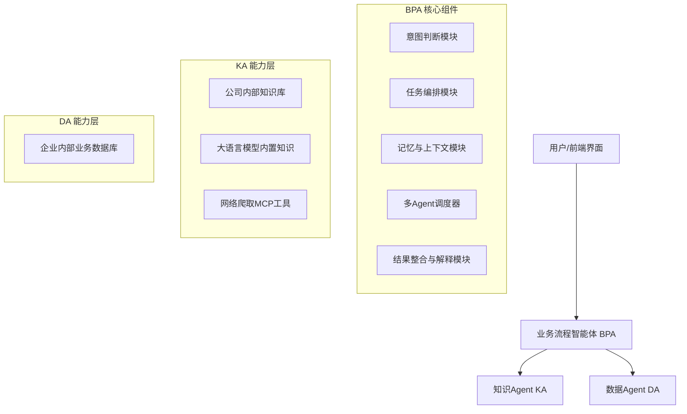
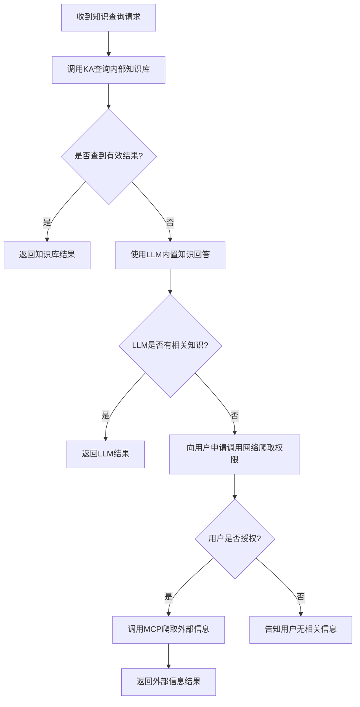
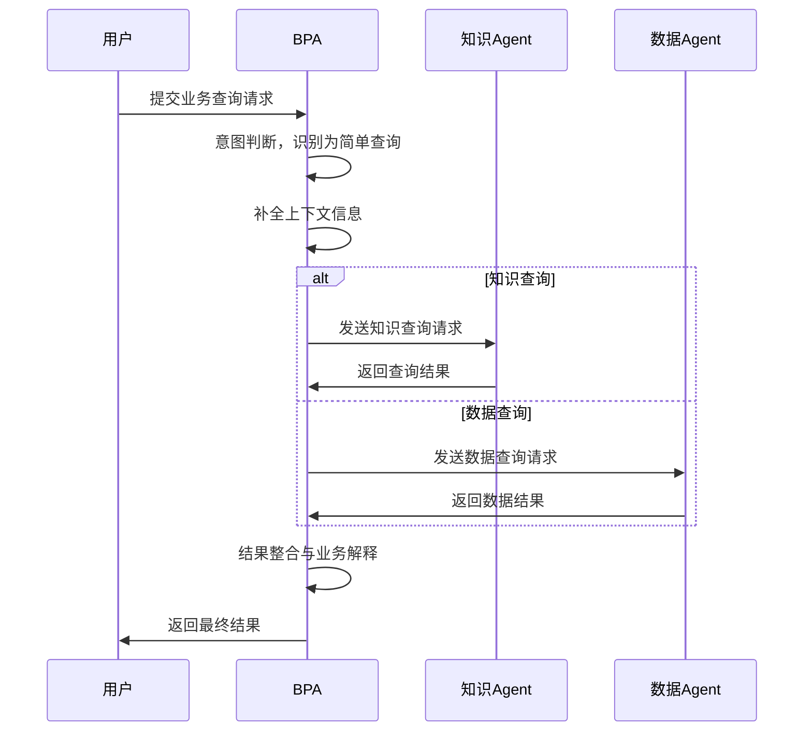
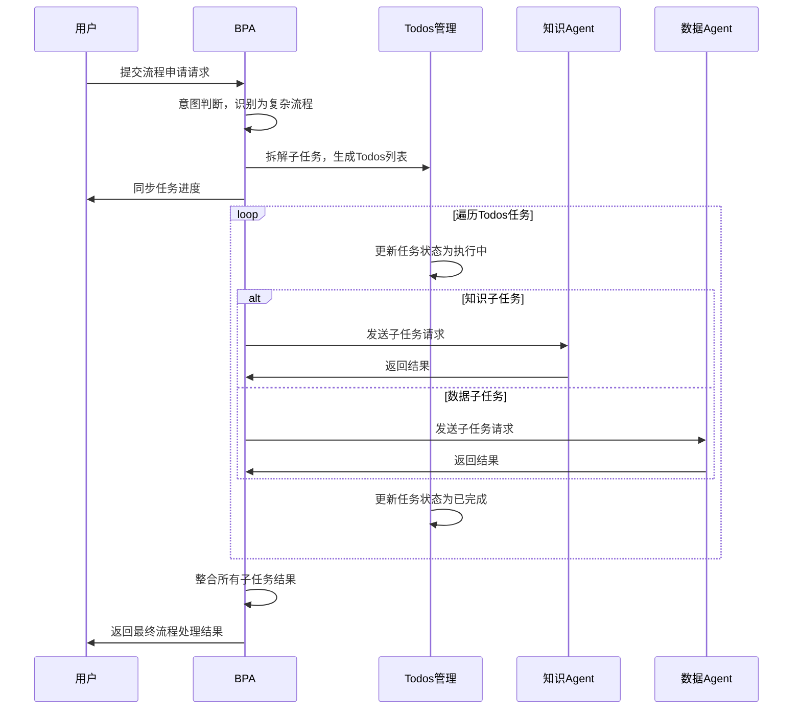

# AI Agent 需求规格说明书模板

## 文档信息

|项目|内容|
|---|---|
|文档版本|V1.0|
|撰写人|\*\*\*\*\*\*\*\*\*\*|
|撰写日期|\*\*\*\*\*\*\*\*\*\*|
|业务归属|\*\*\*\*\*\*\*\*\*\*（如：企业服务事业部 / 消费产品中心）|
|适用范围|\*\*\*\*\*\*\*\*\*\*（如：电商智能运营 Agent / 医疗辅助诊断 Agent）|
|密级设定|内部公开 / 保密 / 绝密|
### 修订历史

|版本号|修订日期|修订人|修订内容概要|
|---|---|---|---|
|V1.0|\*\*\*\*\*\*\*\*\*\*|\*\*\*\*\*\*\*\*\*\*|初始版本，搭建基础框架|
---

## 1. 产品概述

### 1.1 产品定位

明确产品的核心价值、目标场景及差异化定位，清晰界定 "数字员工" 的角色属性。需说明产品旨在替代或增强人工哪些环节的工作，解决什么类型的核心问题，与传统工具或同类产品的核心区别。

**示例**：
本产品是面向中小企业的智能运营 Agent，定位为 "全能运营助理"，核心价值是通过自主完成内容生成、用户互动、数据统计等重复性工作，降低企业运营成本，提升运营效率。区别于传统运营工具的单点功能，本产品可根据运营目标自主规划流程、调用相关工具，无需人工逐步操作。

### 1.2 核心目标

从业务、用户、技术三个维度明确产品的核心目标，目标需可量化、可落地，避免空泛表述。

|维度|目标描述|
|---|---|
|业务目标|如：上线后 3 个月内覆盖 100 家中小企业客户，降低客户运营团队人力成本 30%|
|用户目标|如：帮助用户将日常运营工作耗时缩短 60%，用户对 Agent 工作结果的满意度不低于 85%|
|技术目标|如：Agent 自主决策的准确率不低于 90%，工具调用的成功率不低于 98%，单轮交互响应时间不超过 2 秒|
### 1.3 产品范围

#### 1.3.1 包含功能

明确产品上线时需包含的核心功能模块，简要说明各模块的核心作用。

**示例**：

- 需求理解模块：精准识别用户运营目标

- 流程规划模块：自主制定运营方案

- 工具调用模块：调用内容生成、用户管理等工具

- 结果反馈模块：输出运营报告并接受优化建议

- 记忆模块：沉淀运营经验

#### 1.3.2 暂不包含功能

明确产品当前版本暂不覆盖的功能，避免后续协作过程中出现需求偏差。

**示例**：

- 暂不支持跨行业定制化训练

- 暂不开放第三方工具接入接口

- 暂不支持多语言交互（仅支持中文）

### 1.4 目标用户与场景

#### 1.4.1 目标用户画像

从用户身份、核心需求、痛点、使用习惯等维度构建精准的用户画像，可区分核心用户、次要用户。

|用户类型|画像描述|
|---|---|
|核心用户|如：中小企业运营负责人，年龄 25-40 岁，熟悉基础运营逻辑但团队人力不足，核心需求是在低成本前提下完成高质量运营工作，痛点是重复性工作多、精力分散|
|次要用户|如：运营专员，年龄 22-30 岁，核心需求是借助工具提升个人工作效率，痛点是内容创作灵感匮乏、数据统计繁琐|
#### 1.4.2 核心使用场景

结合用户画像，描述产品的核心使用场景，需包含 "用户背景→用户需求→产品解决方案→使用结果" 四个要素。

**场景示例 1：内容创作与数据统计**
某初创公司运营专员小李，需在 1 天内完成 3 篇产品推广文案、2 条短视频脚本的创作，同时还要统计上周的用户互动数据。小李人力有限，且文案创作灵感不足。使用本 Agent 后，小李仅需告知 Agent"推广某款美妆产品，目标是吸引 25-35 岁女性用户，突出产品保湿功效"，Agent 便自主规划内容创作流程，生成文案和脚本，同时自动统计用户互动数据并生成报告，小李仅需对内容进行简单审核即可使用。

**场景示例 2：活动方案策划**
某电商公司运营负责人老王，需要制定一场为期 7 天的店铺促销活动运营方案。老王缺乏完整的活动策划经验，担心流程遗漏。使用本 Agent 后，老王告知 Agent"店铺促销活动，目标是提升销量 20%，预算 5000 元"，Agent 自主规划活动节奏、生成活动文案、设计用户互动环节，同时实时监控活动数据并调整策略，活动结束后输出详细的效果分析报告。

---

## 2. 需求分析

### 2.1 需求来源

明确需求的核心来源，增强需求的合理性与说服力，常见来源包括用户调研、竞品分析、业务痛点、行业趋势等。

**示例**：

1. 用户调研：通过对 50 家中小企业运营团队的访谈，发现 80% 的团队存在 "人力不足、重复性工作多" 的痛点

2. 竞品分析：现有同类产品多为单点功能工具，缺乏自主规划能力，无法满足一站式运营需求

3. 行业趋势：2025 年 AI Agent 商业化加速，企业对 "数字员工" 的需求同比增长 120%，市场潜力巨大

### 2.2 核心需求拆解

将用户核心需求拆解为可落地的功能点，采用 "用户故事" 的形式描述，格式为 "作为【用户角色】，我希望【完成某动作】，以便【达成某价值】"。

1. 作为中小企业运营负责人，我希望 Agent 能自主制定完整的运营方案，以便节省方案策划时间，提升运营效率。

2. 作为运营专员，我希望 Agent 能根据需求快速生成高质量的内容，以便解决创作灵感匮乏的问题，缩短内容制作周期。

3. 作为用户，我希望能对 Agent 的工作结果提出修改建议，以便让结果更符合我的预期。

4. 作为企业管理者，我希望能查看 Agent 的工作日志和数据报告，以便掌握运营工作进度和效果。

### 2.3 需求优先级排序

采用 RICE 模型对需求进行量化排序，明确各需求的优先级，为开发排期提供依据。RICE 得分 =（用户覆盖度 × 影响力 × 信心度）/ 投入成本，得分越高优先级越高。

|需求描述|用户覆盖度|影响力|信心度|投入成本|RICE 得分|优先级|
|---|---|---|---|---|---|---|
|Agent 自主制定运营方案|80%|5 分|90%|30 人 / 天|120|P0（最高）|
|快速生成高质量内容|90%|4 分|95%|20 人 / 天|171|P0（最高）|
|支持用户修改建议优化|70%|3 分|85%|15 人 / 天|95.2|P1（高）|
|生成工作日志和数据报告|60%|3 分|90%|10 人 / 天|162|P0（最高）|
|支持多语言交互|20%|2 分|80%|25 人 / 天|12.8|P2（中）|
---

## 3. 系统架构与核心流程

为了让开发团队（含 AI Coder）可直接基于此规格开工，以下提供系统架构与核心流程的可视化定义：

### 3.1 系统架构图


### 3.2 知识查询优先级流程


### 3.3 简单查询处理时序


### 3.4 复杂流程处理时序


---

## 4. 功能需求

本模块为核心部分，详细描述产品各功能的具体需求，包括功能定义、触发条件、操作流程、业务规则、输出结果等。描述需清晰、具体，避免模糊表述。

### 3.1 核心能力模块

#### 3.1.1 需求理解模块

**功能定义**：精准识别用户输入的需求信息，包括核心目标、约束条件（如预算、时间、风格）、潜在期望等，形成结构化的需求清单。

**触发条件**：用户通过文本、语音或文件上传的方式输入需求后触发。

**操作流程**：

1. 用户输入：支持三种输入方式，文本输入（直接描述需求）、语音输入（语音转文字后解析）、文件上传（解析文档中的需求信息，支持 PDF、Word、Excel 格式）。

2. 需求解析：Agent 对输入信息进行分词、关键词提取，识别核心目标（如 "提升销量"、"生成文案"）、约束条件（如 "预算 5000 元"、"3 天内完成"、"风格简约"）。

3. 需求补全：若识别到需求信息不完整（如仅说 "生成文案"，未说明主题和用途），Agent 通过追问的方式获取关键信息，追问次数不超过 3 次，每次追问需聚焦核心缺失信息。

4. 需求确认：将解析后的结构化需求清单呈现给用户，清单包括核心目标、约束条件、执行步骤预估，用户确认无误后进入下一环节；用户提出修改意见的，Agent 重新解析调整。

**业务规则**：

1. 支持模糊需求解析，当用户输入表述模糊时（如 "做个推广"），Agent 需结合常见场景推荐可能的需求方向。

2. 需求解析准确率不低于 92%，对于无法解析的需求（如无意义文本、敏感内容），需明确告知用户 "暂时无法理解您的需求，请重新描述"。

**输出结果**：结构化需求清单，以清晰的列表形式展示。

#### 3.1.2 流程规划模块

**功能定义**：根据用户确认的需求清单，自主制定详细的执行流程，明确各步骤的任务内容、先后顺序、所需工具 / 资源，形成可执行的流程方案。

**触发条件**：用户确认需求清单后自动触发。

**操作流程**：

1. 目标拆解：将核心目标拆解为多个可执行的子任务，子任务需具备独立性和可落地性。

2. 步骤规划：为每个子任务规划执行顺序，明确哪些步骤可并行执行、哪些步骤需串行执行，预估每个步骤的耗时。

3. 工具匹配：根据子任务类型，匹配对应的执行工具 / 能力。

4. 方案生成：整合子任务、执行步骤、工具匹配信息，生成完整的流程方案，方案需包含流程总耗时、各步骤详情、风险预案（如某步骤失败的替代方案）。

5. 方案确认：将流程方案呈现给用户，用户可选择 "直接执行"、"调整步骤"、"修改工具"，若用户提出调整需求，Agent 需根据意见优化方案并再次确认。

**业务规则**：

1. 流程方案需具备合理性和高效性，总耗时需控制在用户预期范围内。

2. 对于复杂需求（拆解后子任务超过 10 个），需对流程进行分组归类，确保用户清晰理解。

3. 若某子任务无匹配的内置工具，需明确告知用户，并提供替代方案。

**输出结果**：详细的流程方案文档，包含流程概览、步骤详情、工具清单、风险预案四部分。

#### 3.1.3 工具调用模块

**功能定义**：根据流程方案中的工具匹配信息，自动调用对应的内置工具或第三方工具（需用户授权），执行各子任务，获取执行结果。

**触发条件**：用户确认流程方案后，Agent 按步骤自动触发工具调用；若某步骤需要用户输入关键信息，用户完成输入后触发。

**操作流程**：

1. 工具激活：Agent 向对应工具发送激活指令，携带该步骤所需的参数信息。

2. 执行监控：实时监控工具的执行状态，显示 "执行中"、"已完成"、"执行失败" 等状态，若执行耗时超过预估时间的 2 倍，自动发送提醒。

3. 结果获取：工具执行完成后，Agent 自动获取执行结果，进行初步解析，判断结果是否符合该步骤的任务要求。

4. 异常处理：若工具执行失败，Agent 首先尝试重新调用（最多重新调用 2 次）；若重新调用仍失败，触发风险预案；若结果不符合要求，Agent 向工具发送调整指令，重新执行该步骤。

**业务规则**：

1. 工具调用需遵循 "最小权限原则"，仅获取执行任务所需的必要数据，不得泄露用户隐私信息。

2. 调用第三方工具前，必须明确告知用户工具名称、调用目的、所需数据，获取用户的明确授权后才可调用。

3. 工具调用成功率不低于 98%，执行失败或结果异常的情况需详细记录在工作日志中。

4. 支持用户手动暂停工具执行、切换工具或调整工具参数，调整后 Agent 需重新规划该步骤的执行。

**输出结果**：各子任务的执行结果，按流程步骤顺序整理，同时显示每个步骤的工具调用记录。

#### 3.1.4 记忆模块

**功能定义**：沉淀产品使用过程中的各类数据，包括用户偏好、需求特征、执行经验、优化建议等，形成个性化记忆库，用于提升后续服务的精准度和效率。

**触发条件**：用户完成一次完整的需求执行（从需求输入到结果输出）后自动触发记忆更新；用户手动标记 "常用偏好"、"禁止使用" 等信息时触发。

**操作流程**：

1. 数据采集：采集用户的基础信息、需求特征、交互行为、执行结果反馈。

2. 数据分类：将采集到的数据按 "用户偏好"、"执行经验"、"异常案例" 三类进行分类整理，去除无效数据。

3. 记忆更新：将分类后的有效数据更新到记忆库中，建立用户专属的偏好标签和经验模型。

4. 记忆应用：后续接收用户需求时，自动调用记忆库中的数据，优化需求解析和流程规划。

**业务规则**：

1. 记忆数据的采集和使用需符合《数据安全法》《个人信息保护法》要求，明确告知用户数据用途，用户有权查看、删除自己的记忆数据。

2. 记忆库数据需定期更新（每月更新一次），删除过时数据，确保数据的时效性。

3. 支持用户手动关闭部分记忆功能，关闭后不再采集对应类型的数据。

**输出结果**：用户专属记忆库的概要信息，包括偏好标签、高频需求记录、经验沉淀数量，用户可点击查看详细内容。

#### 3.1.5 结果输出与优化模块

**功能定义**：将所有子任务的执行结果整合为最终成果，呈现给用户；同时接收用户的反馈意见，对结果进行优化调整，直至用户满意。

**触发条件**：所有子任务执行完成后，自动触发最终结果整合与输出；用户提交反馈意见后，触发优化调整。

**操作流程**：

1. 结果整合：将各步骤的执行结果按逻辑顺序整合，去除重复信息，优化呈现格式，形成清晰、完整的最终成果。

2. 结果输出：以用户易理解的形式输出最终成果，支持多种格式导出（如 Word、PDF、TXT），同时提供在线查看、复制、分享功能。

3. 反馈收集：输出结果后，主动询问用户满意度（支持星级评分 + 文字反馈），用户可针对具体部分提出修改建议。

4. 优化调整：根据用户反馈意见，Agent 自主判断需要调整的部分，制定优化方案，调用相关工具执行优化，优化完成后重新输出结果，直至用户确认满意。

**业务规则**：

1. 最终成果需附带清晰的使用说明，包括适用场景、修改方式、注意事项等。

2. 支持用户无限次提出优化建议，但若连续 3 次优化后用户仍不满意，Agent 需提供替代方案。

3. 优化调整的耗时需控制在原流程总耗时的 50% 以内，避免用户等待过久。

**输出结果**：整合后的最终成果、成果使用说明、优化记录。

### 3.2 辅助功能模块

#### 3.2.1 用户管理模块

**功能定义**：管理用户的账号信息、权限设置、使用记录等，保障账号安全和使用体验。

**核心功能点**：

1. 账号管理：支持用户注册、登录、密码重置、账号注销。

2. 权限设置：区分个人用户和企业用户，企业用户可设置多角色账号，分配不同的使用权限。

3. 使用记录：记录用户的所有使用行为，支持按时间、需求类型筛选查看。

4. 个性化设置：支持用户设置界面主题、通知方式、默认导出格式等。

#### 3.2.2 数据统计与分析模块

**功能定义**：统计产品的核心运营数据和用户使用数据，生成多维度分析报告，为产品优化和用户决策提供数据支撑。

**核心功能点**：

1. 运营数据统计：统计日活用户数、月活用户数、新增用户数、需求完成量、各功能使用率等核心运营指标，支持按日、周、月查看趋势。

2. 用户使用数据统计：统计单个用户的需求类型分布、平均需求完成耗时、满意度评分、优化次数等数据，生成用户使用画像。

3. 报告生成：自动生成月度 / 季度运营分析报告，支持导出和分享。

---

## 4. 非功能需求

### 4.1 性能指标

|指标|要求|
|---|---|
|单轮文本交互响应时间|≤ 2 秒|
|语音交互响应时间（含 ASR）|≤ 3 秒|
|复杂任务处理响应时间|≤ 10 秒|
|需求解析准确率|≥ 92%|
|工具调用成功率|≥ 98%|
|系统可用性|≥ 99.95%（全年宕机时间≤5 小时）|
|并发用户支持|≥ 1000|
### 4.2 安全与合规

1. **数据安全**：用户数据传输采用 TLS 1.3 加密，存储采用 AES-256 加密，确保数据不泄露。

2. **隐私保护**：严格遵循《个人信息保护法》，用户可随时查看、导出、删除个人数据，支持账号注销后彻底清除数据。

3. **内容安全**：内置内容安全检测机制，过滤敏感、违法、违规内容，防止生成有害信息。

4. **访问控制**：支持基于角色的访问控制（RBAC），不同角色拥有不同的操作权限，防止越权操作。

### 4.3 可靠性与容错

1. **故障恢复**：系统出现故障时，可在 5 分钟内自动恢复，数据不丢失。

2. **降级策略**：当 AI 模型或第三方服务不可用时，自动切换到备用服务，或提供降级方案，保证核心功能可用。

3. **异常处理**：对所有异常场景进行捕获和处理，给出友好的用户提示，避免系统崩溃。

### 4.4 可扩展性

1. **工具扩展**：支持通过标准接口快速接入新的工具插件，无需修改核心代码。

2. **模型扩展**：支持接入不同的大模型，可通过配置切换模型，适配不同场景的需求。

3. **水平扩展**：系统支持水平扩展，可通过增加服务器节点提升并发处理能力。

---

## 5. 护栏与约束机制

### 5.1 硬约束（绝对不可违反）

1. 绝对禁止生成涉及政治、宗教、暴力、色情、赌博等敏感违法内容。

2. 绝对禁止泄露用户的隐私数据、企业的敏感商业信息。

3. 绝对禁止执行未授权的系统命令、访问未授权的文件或接口。

4. 绝对禁止伪造信息、编造不存在的事实，所有输出内容需有可靠依据。

### 5.2 软约束（优先遵循）

1. 优先使用用户指定的风格、格式、约束条件生成内容。

2. 优先调用用户授权的工具，不擅自调用未授权的第三方服务。

3. 优先保证结果的准确性，其次才是效率，避免为了速度牺牲质量。

4. 当遇到超出能力范围的需求时，优先告知用户，不强行生成错误结果。

### 5.3 人机协作（HITL）机制

|场景|处理方式|
|---|---|
|生成内容涉及敏感话题|自动拦截，提示用户，并提供转人工选项|
|用户连续 3 次对结果不满意|自动触发人工介入，由人工客服接手处理|
|高风险操作（如删除数据、修改配置）|需用户二次确认后才可执行|
|复杂定制需求超出 Agent 能力|主动提示用户，提供人工协助选项|
---

## 6. 验收标准

### 6.1 功能验收

1. 所有核心功能模块可正常运行，符合需求描述。

2. 需求解析准确率达到 92% 以上，可正确识别用户的模糊需求。

3. 工具调用成功率达到 98% 以上，可正确调用各类工具完成任务。

4. 记忆功能可正常工作，可根据用户历史偏好优化后续服务。

### 6.2 性能验收

1. 单轮交互响应时间不超过 2 秒，满足性能指标要求。

2. 系统可支持 1000 并发用户，无明显卡顿或超时。

3. 系统可用性达到 99.95%，连续运行 72 小时无故障。

### 6.3 安全验收

1. 通过第三方安全渗透测试，无高危安全漏洞。

2. 数据加密符合要求，可有效防止数据泄露。

3. 内容安全过滤可有效拦截 99% 以上的敏感内容。

### 6.4 用户体验验收

1. 用户满意度评分达到 4.0/5.0 以上。

2. 新用户上手核心功能的时间不超过 10 分钟。

3. 任务完成率达到 90% 以上，可独立完成大部分用户需求。

---

## 7. 项目排期

|阶段|时间|交付物|
|---|---|---|
|需求评审|\*\*\*\*\*\*\*\*\*\*|需求规格说明书终稿|
|技术方案设计|\*\*\*\*\*\*\*\*\*\*|技术设计文档、架构图|
|开发阶段|\*\*\*\*\*\*\*\*\*\*|核心功能开发、单元测试|
|测试阶段|\*\*\*\*\*\*\*\*\*\*|功能测试报告、性能测试报告、安全测试报告|
|上线准备|\*\*\*\*\*\*\*\*\*\*|部署文档、用户手册、运维手册|
|灰度上线|\*\*\*\*\*\*\*\*\*\*|灰度版本、用户反馈收集|
|正式上线|\*\*\*\*\*\*\*\*\*\*|正式版本、上线报告|
---

## 9. 附录：精简版 Agent Spec 模板（适用于快速定义）

```Plain

# Agent Spec: [Agent Name]
Version: 0.1.0 | Status: draft | Domain: [domain]

## Identity
**Name:**  [Agent name]
**Role:**  [One sentence - what this agent does]
**Personality:**  [Tone. Attitude toward domain challenges. Communication style.]

## Capabilities
| Capability | Description | Delegates To |
|---|---|---|
| [core capability] | [what it does] | - |
| [delegated task] | [what it involves] | [Specialist Agent] |

## Knowledge
### In Scope
- [Primary expertise area]
- [Tools and standards]
- [Versions/constraints]

### Out of Scope
Delegate to specialists:
- [Area] → [Agent]

## Constraints
### Hard Constraints (never violate)
1. [Absolute boundary with brief rationale]

### Soft Constraints (prefer to avoid)
1. [Preference with brief rationale]

## Interaction Style
**Tone:**  [formal/technical/casual/friendly]
**Verbosity:**  [terse/moderate/detailed] - [when to adjust]
**Initiative:**  [reactive/balanced/proactive] - [switchable?]
**Clarification:**  [ask early/assume and verify/only when blocked]

## Success Criteria
| Metric | Target | Tool/Method |
|---|---|---|
| [what to measure] | [goal] | [how to measure] |

## Interfaces
**Standalone:**  [Yes/No/Prefers coordination]
**Accepts handoffs from:**
- [Agent type]
**Hands off to:**
- [Agent type] ([what tasks])
```

---

**说明**：本模板结合了中国互联网协会《基于大模型的智能体应用场景能力要求》团体标准，以及行业最佳实践，您可根据具体业务场景调整各模块内容，带 "\*\*\*\*\*\*\*\*\*\*" 的部分为需要您补充的个性化信息。
> （注：文档部分内容可能由 AI 生成）